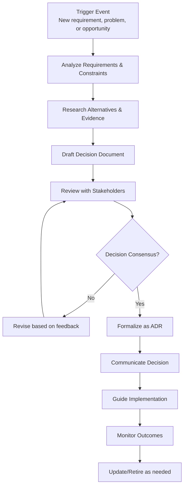
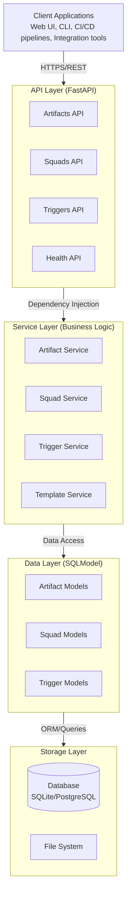
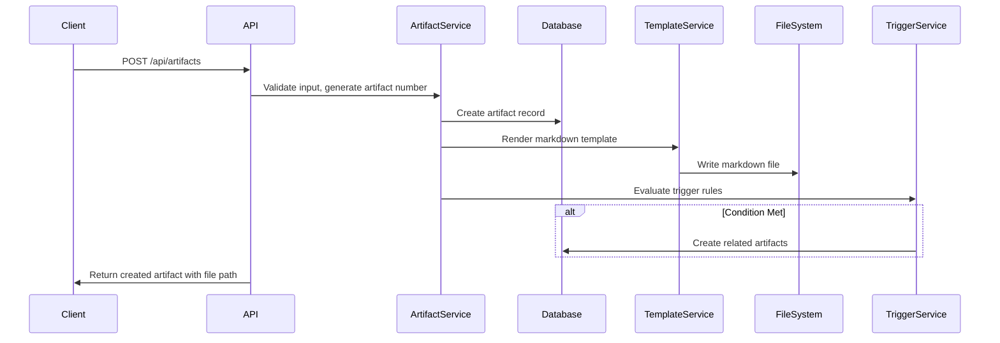
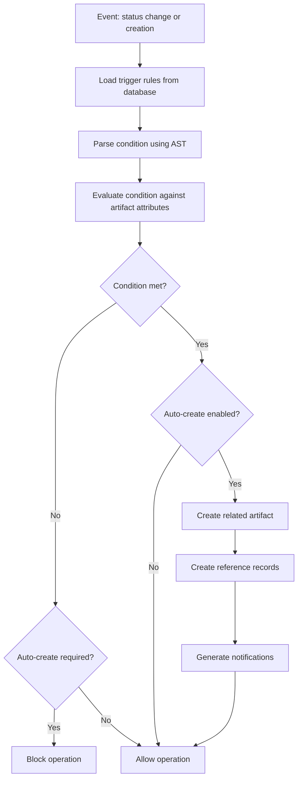
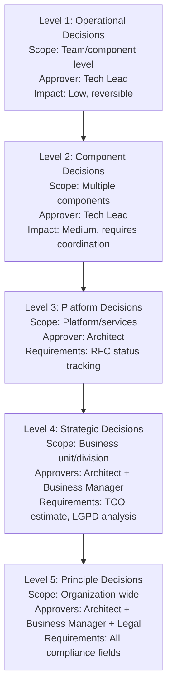
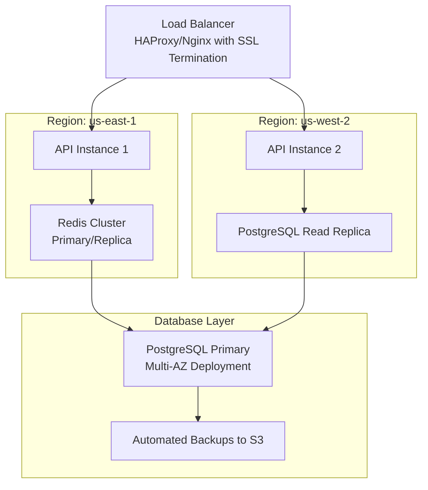

# Solutions Architect Handbook - ADR Hub

## Executive Summary

**ADR Hub** is an enterprise-grade Architecture Decision Record (ADR) management system designed to transform architecture governance from scattered markdown files into a queryable, auditable system. This handbook provides solution architects and enterprise architects with comprehensive guidance for implementing, operating, and extending the ADR Hub platform.

*Insights in this handbook are informed by industry practices and the experience of Scarlet Rose, Solutions Architect at Itaú, on the practical application of architecture governance in enterprise environments.*

---

## 1. Understanding Solutions Architecture

### 1.1 What is a Solutions Architect?

A **Solutions Architect** bridges the gap between business requirements and technical implementation, translating strategic goals into actionable architectural designs. Unlike software engineers who focus on implementation details, solutions architects operate at a higher abstraction level, considering:

- **Business Context**: How technical decisions impact business outcomes
- **Technical Feasibility**: Balancing innovation with practical constraints  
- **Risk Management**: Identifying and mitigating architectural risks
- **Stakeholder Alignment**: Ensuring technical decisions satisfy all parties
- **Compliance & Governance**: Navigating regulatory and organizational constraints

### 1.2 Types of Architects in Enterprise Organizations

| Role | Primary Focus | Key Responsibilities | Decision Scope |
|------|---------------|---------------------|----------------|
| **Solutions Architect** | Business-Technology alignment | Solution design, requirement analysis, stakeholder management | Cross-system, project-level |
| **Enterprise Architect** | Strategic direction | Technology roadmap, standards, portfolio management | Organization-wide, strategic |
| **Domain Architect** | Specific business domain | Domain-specific patterns, data models, integration | Business unit, domain-focused |
| **Technical Architect** | Implementation patterns | Technical standards, coding guidelines, tech stack selection | Technology stack, team-level |
| **Cloud Architect** | Cloud infrastructure | Cloud strategy, cost optimization, platform selection | Cloud environment, infrastructure |

### 1.3 Core Competencies of Solutions Architects

1. **Technical Breadth**: Understanding multiple technologies, platforms, and patterns
2. **Business Acumen**: Translating business requirements into technical solutions
3. **Communication Skills**: Articulating complex concepts to diverse audiences
4. **Risk Assessment**: Identifying and mitigating technical and business risks
5. **Governance Navigation**: Working within organizational constraints and compliance frameworks
6. **Strategic Thinking**: Balancing immediate needs with long-term architectural vision

### 1.4 Day-to-Day Activities

A typical solutions architect's work involves:
- **Requirement Analysis**: Understanding business needs and technical constraints
- **Solution Design**: Creating architectural diagrams and specifications
- **Stakeholder Meetings**: Aligning business, development, and operations teams
- **Decision Documentation**: Capturing architectural decisions and their rationale
- **Risk Assessment**: Evaluating technical and compliance risks
- **Governance Compliance**: Ensuring solutions meet organizational standards
- **Technology Evaluation**: Assessing new tools, frameworks, and platforms

---

## 2. Artifacts Used by Solutions Architects

### 2.1 Architecture Decision Records (ADRs)

**Purpose**: Capture important architectural decisions with context, alternatives considered, and rationale.
- **Format**: Structured markdown with clear sections
- **Audience**: Development teams, future architects, auditors
- **Lifecycle**: Proposed → Accepted → Superseded → Retired

**Example Use Cases**:
- Choosing between microservices vs monolithic architecture
- Selecting a database technology (SQL vs NoSQL)
- Defining API design patterns (REST vs GraphQL)
- Establishing security protocols and compliance requirements

### 2.2 Solution Design Documents (SDDs)

**Purpose**: Comprehensive documentation of solution architecture including components, interactions, and deployment considerations.
- **Format**: Detailed document with diagrams, specifications, and constraints
- **Audience**: Development teams, project managers, stakeholders
- **Content**: Architecture diagrams, data flows, security considerations, scalability plans

### 2.3 Request for Comments (RFCs)

**Purpose**: Socialize architectural proposals for feedback before formalization.
- **Format**: Proposal document with problem statement, proposed solution, and open questions
- **Audience**: Technical community, subject matter experts
- **Process**: Draft → Review → Revised → Accepted/Rejected

### 2.4 Evidence Artifacts

**Purpose**: Support architectural decisions with data, research, or proof-of-concept results.
- **Types**: Performance benchmarks, security assessments, compliance checks, cost analysis
- **Format**: Reports, test results, analysis documents
- **Importance**: Provides objective basis for subjective architectural choices

### 2.5 Governance Artifacts

**Purpose**: Document organizational policies, standards, and compliance requirements.
- **Examples**: Security policies, data protection standards, deployment guidelines
- **Audience**: All technical teams, compliance officers
- **Enforcement**: Mandatory requirements with validation mechanisms

### 2.6 Implementation Artifacts

**Purpose**: Detailed technical specifications for development teams.
- **Content**: API specifications, data models, interface definitions, deployment scripts
- **Audience**: Development and operations teams
- **Relationship**: Derived from higher-level architectural decisions

---

## 3. Solutions Architect Workflow

### 3.1 The Architecture Decision Lifecycle



### 3.2 Stakeholder Engagement Model

Solutions architects work with multiple stakeholder groups:

| Stakeholder Group | Engagement Focus | Communication Style |
|-------------------|------------------|---------------------|
| **Business Leaders** | Value proposition, ROI, strategic alignment | Business outcomes, cost-benefit analysis |
| **Development Teams** | Implementation feasibility, technical details | Technical specifications, code examples |
| **Operations Teams** | Deployment, monitoring, maintenance | Operational requirements, SLAs |
| **Security Teams** | Risk assessment, compliance requirements | Security controls, threat models |
| **Product Managers** | Feature requirements, timelines | User stories, product roadmap |

### 3.3 Decision-Making Framework

1. **Problem Definition**: Clearly articulate the problem or opportunity
2. **Constraint Analysis**: Identify technical, business, and compliance constraints
3. **Alternative Generation**: Brainstorm multiple solution approaches
4. **Evaluation Criteria**: Define objective criteria for comparison
5. **Evidence Gathering**: Collect data to support each alternative
6. **Risk Assessment**: Evaluate risks for each option
7. **Recommendation**: Propose solution with supporting rationale
8. **Validation**: Socialize with stakeholders for feedback
9. **Documentation**: Capture decision in appropriate artifacts
10. **Communication**: Share decision with affected parties

### 3.4 Collaboration Patterns

- **Architecture Review Boards**: Formal governance bodies for significant decisions
- **Community of Practice**: Informal groups for knowledge sharing
- **Pair Designing**: Collaborative solution design sessions
- **Architecture Katas**: Practice sessions for architectural problem-solving
- **Brown Bag Sessions**: Informal knowledge sharing meetings

---

## 4. How Solutions Architects Use ADR Hub

### 4.1 Daily Operations with ADR Hub

**Morning Routine**:
1. Check dashboard for new artifacts requiring review
2. Review pending ADRs at your approval level
3. Monitor health metrics for compliance gaps
4. Respond to notifications about status changes

**Design Sessions**:
1. Create draft ADRs during architecture discussions
2. Link RFCs to ADRs for traceability
3. Attach evidence artifacts to support decisions
4. Set up triggers for automatic follow-up actions

**Review & Approval**:
1. Receive notifications for artifacts at your approval level
2. Review ADRs with embedded evidence and compliance checks
3. Provide feedback directly in the system
4. Approve/reject with documented rationale
5. Monitor approval chains for Level 4-5 decisions

**Compliance Management**:
1. Track LGPD analysis requirements for data-sensitive decisions
2. Monitor TCO estimates for cost-impacting decisions
3. Validate RFC status before approving Level 3+ ADRs
4. Generate compliance reports for audit purposes

### 4.2 Strategic Planning with ADR Hub

**Portfolio Management**:
- Analyze artifact distribution across squads and domains
- Identify knowledge gaps in architecture documentation
- Track decision evolution over time
- Monitor compliance across business units

**Risk Management**:
- Flag ADRs with incomplete compliance information
- Identify decisions approaching supersession dates
- Monitor health scores for architectural components
- Track mitigation actions for identified risks

**Knowledge Management**:
- Search historical decisions by technology, domain, or team
- Analyze decision patterns and trends
- Identify reusable architecture patterns
- Document lessons learned from past decisions

### 4.3 Team Enablement

**Onboarding New Architects**:
- Use ADR Hub as a knowledge base for architectural context
- Review historical decisions to understand architecture evolution
- Analyze decision patterns in specific domains
- Learn organizational constraints and compliance requirements

**Team Collaboration**:
- Share ADRs for peer review and feedback
- Establish consistent documentation practices
- Maintain decision traceability across teams
- Foster architecture community through shared artifacts

**Continuous Improvement**:
- Analyze decision quality metrics
- Identify documentation gaps
- Measure time-to-decision metrics
- Track stakeholder satisfaction with architecture processes

### 4.4 Real-World Scenarios

**Scenario 1: Microservices Migration Decision**
- **Problem**: Legacy monolithic application needs modernization
- **ADR Hub Usage**: 
  - Create Level 4 ADR for strategic decision
  - Attach evidence artifacts: performance benchmarks, cost analysis
  - Link RFC for community feedback
  - Complete LGPD analysis for data handling implications
  - Document TCO estimates for 3-year horizon
  - Set trigger to create implementation artifacts when approved

**Scenario 2: Database Technology Selection**
- **Problem**: Need to choose between SQL and NoSQL for new feature
- **ADR Hub Usage**:
  - Create Level 3 ADR for platform decision
  - Attach proof-of-concept results as evidence
  - Reference existing ADRs on data consistency requirements
  - Track RFC status from database community review
  - Document decision rationale for future reference

**Scenario 3: Security Protocol Update**
- **Problem**: Need to implement new authentication protocol
- **ADR Hub Usage**:
  - Create Level 5 ADR for organization-wide security decision
  - Attach security assessment reports as evidence
  - Complete comprehensive compliance checks
  - Document approval chain with security, legal, and business stakeholders
  - Create linked governance artifacts for implementation guidelines

### 4.5 Measuring Success

**Quantitative Metrics**:
- **Decision Velocity**: Time from problem identification to documented decision
- **Compliance Coverage**: Percentage of ADRs with complete compliance information
- **Artifact Utilization**: Frequency of artifact access and reference
- **Approval Cycle Time**: Time spent in review and approval processes
- **Risk Mitigation**: Number of risks identified and addressed through ADR process

**Qualitative Benefits**:
- **Reduced Rework**: Clear decisions prevent misunderstandings and reimplementation
- **Knowledge Retention**: Institutional knowledge preserved despite team changes
- **Audit Readiness**: Complete documentation trail for compliance audits
- **Stakeholder Confidence**: Transparent decision process builds trust
- **Strategic Alignment**: Technical decisions consistently support business goals

---

## 5. ADR Hub System Overview

### 5.1 Core Purpose
ADR Hub provides a unified platform for managing 7 types of architecture artifacts with automated governance workflows, trigger-based automation, and proactive health analysis.

### 5.2 Key Business Value Propositions
- **Governance Automation**: Transform manual ADR processes into automated workflows
- **Compliance Assurance**: Built-in healthcare compliance (LGPD) and regulatory tracking
- **Decision Traceability**: Full audit trail from decision to implementation
- **Risk Mitigation**: Proactive health monitoring and gap detection
- **Knowledge Management**: Centralized repository for architecture decisions and rationale

### 5.3 Strategic Alignment
- **Enterprise Architecture**: Supports TOGAF, Zachman frameworks
- **Agile Governance**: Enables architecture governance in agile environments
- **DevOps Integration**: CI/CD pipeline integration for automated compliance
- **Regulatory Compliance**: Healthcare (HIPAA/LGPD) and financial services ready

---

## 6. Architecture Principles

### 6.1 Design Principles
1. **Separation of Concerns**: Clear boundaries between API, business logic, and data access
2. **Dependency Inversion**: High-level modules don't depend on low-level implementations
3. **Testability**: All components are independently testable with dependency injection
4. **Maintainability**: Modular design with single responsibility per component
5. **Security by Design**: AST-based safe evaluation, input validation, secure defaults

### 6.2 Architecture Style
- **Clean Architecture**: Follows Robert C. Martin's Clean Architecture principles
- **REST API**: Stateless, resource-oriented API design
- **Microservices Ready**: Containerized, independently deployable components
- **Database Agnostic**: SQLite for development, PostgreSQL for production

### 6.3 Quality Attributes
| Attribute | Strategy | Implementation |
|-----------|----------|---------------|
| **Scalability** | Horizontal scaling, stateless design | FastAPI with async support, connection pooling |
| **Reliability** | Retry logic, circuit breakers, health checks | Health service, database monitoring, retry decorators |
| **Security** | Defense in depth, least privilege | AST-based evaluation, input validation, role-based access |
| **Maintainability** | Modular design, clear interfaces | Clean Architecture layers, dependency injection |
| **Performance** | Caching, efficient queries, indexing | Query optimization, Redis integration (planned) |

---

## 7. Technical Architecture

### 7.1 System Architecture



### 7.2 Component Responsibilities

#### 7.2.1 API Layer (`src/api/`)
- **Artifacts API**: CRUD operations for all 7 artifact types
- **Squads API**: Team management and lifecycle operations
- **Triggers API**: Rule definition and evaluation endpoints
- **Health API**: System monitoring and status endpoints

#### 7.2.2 Service Layer (`src/services/`)
- **ArtifactService**: Core business logic for artifact management
- **SquadService**: Team governance and ownership logic
- **TriggerService**: Rule evaluation and automation engine
- **TemplateService**: Markdown template rendering and management
- **HealthService**: System monitoring and proactive analysis

#### 7.2.3 Data Layer (`src/models/`)
- **Artifact Models**: Unified model for all artifact types
- **Squad Models**: Team structure and lifecycle management
- **Trigger Models**: Rule definitions and condition storage
- **Reference Models**: Cross-references between artifacts

### 7.3 Data Flow Patterns

#### 7.3.1 Artifact Creation Flow



#### 7.3.2 Trigger Evaluation Flow



---

## 8. Artifact Governance Framework

### 8.1 Artifact Taxonomy
| Type | Purpose | Governance Level | Lifecycle |
|------|---------|------------------|-----------|
| **ADR** | Architecture decisions | Level 1-5 | Proposed → Accepted → Superseded |
| **RFC** | Request for comments | Advisory | Draft → Review → Accepted |
| **Evidence** | Supporting evidence | Informational | Collected → Validated → Archived |
| **Governance** | Policy definitions | Mandatory | Draft → Approved → Enforced |
| **Implementation** | Technical details | Tactical | Planned → Implemented → Verified |
| **Visibility** | Observability decisions | Operational | Defined → Implemented → Monitored |
| **Uncommon** | Edge cases | Special | Documented → Reviewed → Archived |

### 8.2 ADR Level System

#### 8.2.1 Level Definitions



#### 8.2.2 Validation Matrix
| Level | Required Approvals | Compliance Fields | Business Impact |
|-------|-------------------|-------------------|-----------------|
| 1-2 | Tech Lead | None | Low-Medium |
| 3 | Architect | RFC status | Medium |
| 4-5 | Architect + Business Manager | TCO, LGPD, Health compliance | High |

### 8.3 Compliance Framework

#### 8.3.1 Healthcare Compliance (LGPD/HIPAA)
- **LGPD Analysis**: Required for Level 4-5 ADRs
- **Data Protection Impact Assessment**: Integrated into artifact templates
- **Risk Classification**: Low/Medium/High risk categorization
- **Mitigation Requirements**: Automatic tracking of compliance actions

#### 8.3.2 Financial Compliance
- **TCO Estimates**: Required for Level 4-5 ADRs
- **ROI Calculations**: Built into decision framework
- **Risk Assessment**: Integrated risk scoring

#### 8.3.3 Audit Requirements
- **Full Audit Trail**: All changes tracked with timestamps
- **Approval Chains**: Complete approval history
- **Decision Rationale**: Structured rationale documentation
- **Compliance Evidence**: Linked evidence artifacts

---

## 9. Integration Patterns

### 9.1 CI/CD Integration
```yaml
# GitHub Actions Integration Example
jobs:
  architecture-compliance:
    runs-on: ubuntu-latest
    steps:
      - name: Check ADR requirements
        run: |
          curl -X POST ${{ secrets.ADR_HUB_URL }}/api/health/compliance-check \
            -H "Authorization: Bearer ${{ secrets.ADR_HUB_TOKEN }}" \
            -d '{"project": "${{ github.repository }}", "branch": "${{ github.ref }}"}'
      
      - name: Create ADR for breaking changes
        if: contains(github.event.head_commit.message, 'BREAKING')
        run: |
          curl -X POST ${{ secrets.ADR_HUB_URL }}/api/artifacts \
            -H "Authorization: Bearer ${{ secrets.ADR_HUB_TOKEN }}" \
            -d '{
              "artifact_type": "adr",
              "title": "Breaking Change: ${{ github.event.head_commit.message }}",
              "level": 3,
              "squad_id": "${{ vars.TEAM_ID }}"
            }'
```

### 9.2 IDE Integration
- **VS Code Extension**: ADR creation and management
- **JetBrains Plugin**: Integration with IntelliJ, PyCharm
- **CLI Tool**: Command-line interface for automation

### 9.3 Project Management Integration
- **Jira Integration**: Link ADRs to Jira tickets
- **Linear Integration**: Sync with Linear issues
- **Azure DevOps**: Integration with Azure Boards

### 9.4 Documentation Integration
- **MkDocs/ReadTheDocs**: Automatic documentation generation
- **Confluence Integration**: Sync ADRs to Confluence
- **GitHub Pages**: Automatic publication of architecture docs

---

## 10. Deployment Architecture

### 10.1 Development Environment
```yaml
# docker-compose.dev.yml
services:
  api:
    build: .
    ports: ["8000:8000"]
    environment:
      DATABASE_URL: sqlite:///./locale/governance.db
      ENVIRONMENT: development
    volumes:
      - ./:/app
      - ./locale:/app/locale
      - ./architecture:/app/architecture
  
  # Development tools
  pgadmin:
    image: dpage/pgadmin4
    environment:
      PGADMIN_DEFAULT_EMAIL: admin@example.com
      PGADMIN_DEFAULT_PASSWORD: admin
    ports: ["5050:80"]
```

### 10.2 Production Environment
```yaml
# docker-compose.prod.yml
services:
  api:
    build:
      context: .
      dockerfile: Dockerfile.prod
    ports: ["8000:8000"]
    environment:
      DATABASE_URL: postgresql://postgres:${DB_PASSWORD}@db/adr_hub
      REDIS_URL: redis://redis:6379/0
      ENVIRONMENT: production
      SECRET_KEY: ${SECRET_KEY}
    depends_on:
      - db
      - redis
    healthcheck:
      test: ["CMD", "curl", "-f", "http://localhost:8000/api/health/liveness"]
      interval: 30s
      timeout: 10s
      retries: 3
  
  db:
    image: postgres:15-alpine
    environment:
      POSTGRES_DB: adr_hub
      POSTGRES_USER: postgres
      POSTGRES_PASSWORD: ${DB_PASSWORD}
    volumes:
      - postgres_data:/var/lib/postgresql/data
    healthcheck:
      test: ["CMD-SHELL", "pg_isready -U postgres"]
      interval: 10s
      timeout: 5s
      retries: 5
  
  redis:
    image: redis:7-alpine
    command: redis-server --appendonly yes
    volumes:
      - redis_data:/data
    healthcheck:
      test: ["CMD", "redis-cli", "ping"]
      interval: 10s
      timeout: 5s
      retries: 5
  
  nginx:
    image: nginx:alpine
    ports: ["80:80", "443:443"]
    volumes:
      - ./nginx.conf:/etc/nginx/nginx.conf
      - ./ssl:/etc/nginx/ssl
    depends_on:
      - api

volumes:
  postgres_data:
  redis_data:
```

### 10.3 High Availability Architecture



### 10.4 Disaster Recovery
- **RTO (Recovery Time Objective)**: 4 hours
- **RPO (Recovery Point Objective)**: 1 hour
- **Backup Strategy**: Daily full + hourly incremental
- **Failover Strategy**: Automated regional failover
- **Data Replication**: Cross-region async replication

---

## 11. Security Architecture

### 11.1 Authentication & Authorization
```python
# Planned JWT Authentication
from fastapi import Depends, HTTPException
from fastapi.security import HTTPBearer, HTTPAuthorizationCredentials

security = HTTPBearer()

async def get_current_user(
    credentials: HTTPAuthorizationCredentials = Depends(security)
) -> User:
    token = credentials.credentials
    payload = jwt.decode(token, SECRET_KEY, algorithms=[ALGORITHM])
    user = get_user_from_db(payload["sub"])
    if not user:
        raise HTTPException(status_code=401, detail="Invalid credentials")
    return user

# Role-based authorization
def require_role(required_role: str):
    def role_checker(current_user: User = Depends(get_current_user)):
        if current_user.role != required_role:
            raise HTTPException(status_code=403, detail="Insufficient permissions")
        return current_user
    return role_checker
```

### 11.2 Security Controls

#### 7.2.1 Input Validation
- **Pydantic Models**: Type validation at API boundaries
- **SQL Injection Prevention**: Parameterized queries via SQLModel
- **XSS Prevention**: Output encoding in templates
- **File Upload Security**: Whitelist validation, virus scanning

#### 7.2.2 Data Protection
- **Encryption at Rest**: Database encryption, file system encryption
- **Encryption in Transit**: TLS 1.3, perfect forward secrecy
- **Secrets Management**: Environment variables, secrets manager integration
- **Audit Logging**: Comprehensive security event logging

#### 7.2.3 Access Control
- **Role-Based Access Control (RBAC)**: Viewer, Editor, Tech Lead, Architect, Admin
- **Attribute-Based Access Control (ABAC)**: Fine-grained permissions
- **Team-Based Isolation**: Squad-level data segregation
- **Time-Based Access**: Temporary access grants

### 11.3 Compliance Controls
- **LGPD/HIPAA Compliance**: Data minimization, consent management
- **SOC 2 Controls**: Security, availability, processing integrity
- **GDPR Compliance**: Right to erasure, data portability
- **PCI DSS**: Payment card data protection (if applicable)

---

## 12. Monitoring & Observability

### 12.1 Health Monitoring
```python
# Health Service Implementation
class HealthService:
    async def check_database_health(self) -> HealthCheck:
        """Check database connectivity and performance."""
        start_time = time.time()
        try:
            # Check connection and query performance
            result = await self.session.execute(text("SELECT 1"))
            response_time = (time.time() - start_time) * 1000
            
            return HealthCheck(
                name="database",
                status="healthy" if result.scalar() == 1 else "unhealthy",
                response_time_ms=response_time,
                details={
                    "connection_pool_size": self.engine.pool.size(),
                    "active_connections": self.engine.pool.checkedin(),
                }
            )
        except Exception as e:
            return HealthCheck(
                name="database",
                status="unhealthy",
                error=str(e),
                response_time_ms=(time.time() - start_time) * 1000
            )
```

### 12.2 Metrics Collection
```python
# Prometheus Metrics
from prometheus_fastapi_instrumentator import Instrumentator

# Instrument the FastAPI app
Instrumentator().instrument(app).expose(app)

# Custom metrics
artifacts_created = Counter(
    "adr_hub_artifacts_created_total",
    "Total number of artifacts created",
    ["artifact_type", "squad"]
)

api_request_duration = Histogram(
    "adr_hub_api_request_duration_seconds",
    "API request duration in seconds",
    ["endpoint", "method", "status_code"]
)
```

### 12.3 Logging Strategy
```python
# Structured Logging
import structlog

logger = structlog.get_logger()

async def create_artifact(artifact_data: ArtifactCreate):
    """Create artifact with comprehensive logging."""
    logger.info(
        "artifact_creation_started",
        artifact_type=artifact_data.artifact_type,
        squad_id=artifact_data.squad_id,
        user_id=current_user.id
    )
    
    try:
        artifact = await self._create_artifact(artifact_data)
        logger.info(
            "artifact_created",
            artifact_id=artifact.id,
            artifact_number=artifact.artifact_number,
            duration_ms=(time.time() - start_time) * 1000
        )
        return artifact
    except Exception as e:
        logger.error(
            "artifact_creation_failed",
            error=str(e),
            artifact_type=artifact_data.artifact_type,
            duration_ms=(time.time() - start_time) * 1000
        )
        raise
```

### 12.4 Alerting Strategy
| Metric | Threshold | Alert Channel | Severity |
|--------|-----------|---------------|----------|
| API Error Rate | > 5% last 5min | PagerDuty, Slack | Critical |
| Database Latency | > 500ms p95 | Slack, Email | Warning |
| Health Check Failure | > 2 consecutive | PagerDuty | Critical |
| Artifact Creation Rate | 0 last 1h | Slack | Warning |
| Disk Space | < 20% free | Email, Slack | Warning |

---

## 13. Operational Procedures

### 13.1 Deployment Procedures
```bash
# Blue-Green Deployment Procedure
#!/bin/bash
# deploy.sh

# Step 1: Build new version
docker build -t adr-hub:$NEW_VERSION .

# Step 2: Deploy to green environment
docker-compose -f docker-compose.green.yml up -d

# Step 3: Health check
curl -f http://green.example.com/api/health/readiness || exit 1

# Step 4: Switch traffic
aws elbv2 modify-listener --listener-arn $LISTENER_ARN \
  --default-actions Type=forward,TargetGroupArn=$GREEN_TG_ARN

# Step 5: Monitor for 5 minutes
sleep 300

# Step 6: Decommission blue
docker-compose -f docker-compose.blue.yml down
```

### 13.2 Backup & Recovery
```bash
# Backup Script
#!/bin/bash
# backup.sh

# Database backup
pg_dump -h $DB_HOST -U $DB_USER $DB_NAME > /backups/db-$(date +%Y%m%d).sql

# File system backup
tar -czf /backups/files-$(date +%Y%m%d).tar.gz architecture/ templates/

# Upload to S3
aws s3 cp /backups/db-$(date +%Y%m%d).sql s3://$BACKUP_BUCKET/
aws s3 cp /backups/files-$(date +%Y%m%d).tar.gz s3://$BACKUP_BUCKET/

# Retention policy (keep 30 days)
find /backups -type f -mtime +30 -delete
```

### 13.3 Incident Response
1. **Detection**: Monitoring alerts, user reports
2. **Triage**: Severity assessment, impact analysis
3. **Containment**: Isolate affected components
4. **Investigation**: Root cause analysis
5. **Resolution**: Implement fix, verify recovery
6. **Post-mortem**: Document lessons learned

### 13.4 Capacity Planning
- **Database**: 1GB per 10,000 artifacts
- **File Storage**: 100MB per 1,000 markdown files
- **Memory**: 512MB per API instance + 256MB overhead
- **CPU**: 2 vCPUs for up to 100 concurrent users

---

## 14. Extension & Customization

### 14.1 Plugin Architecture
```python
# Plugin Interface
from abc import ABC, abstractmethod
from typing import Dict, Any

class ADRPlugin(ABC):
    """Base class for ADR Hub plugins."""
    
    @abstractmethod
    def on_artifact_created(self, artifact: Artifact) -> None:
        """Called when an artifact is created."""
        pass
    
    @abstractmethod
    def on_status_changed(self, artifact: Artifact, old_status: str) -> None:
        """Called when artifact status changes."""
        pass

# Plugin Registry
class PluginRegistry:
    def __init__(self):
        self._plugins: List[ADRPlugin] = []
    
    def register(self, plugin: ADRPlugin):
        self._plugins.append(plugin)
    
    def notify_artifact_created(self, artifact: Artifact):
        for plugin in self._plugins:
            plugin.on_artifact_created(artifact)
```

### 14.2 Custom Artifact Types
```python
# Custom Artifact Type Definition
from pydantic import BaseModel
from enum import Enum

class CustomArtifactType(str, Enum):
    SECURITY_REVIEW = "security_review"
    CAPACITY_PLAN = "capacity_plan"
    DISASTER_RECOVERY = "disaster_recovery"

class CustomArtifactCreate(BaseModel):
    artifact_type: CustomArtifactType
    title: str
    content: str
    # Custom fields
    risk_level: str
    mitigation_plan: str
    review_cycle_days: int
    
    class Config:
        use_enum_values = True
```

### 14.3 Integration Extensions
- **Custom Export Formats**: PDF, Word, Excel
- **External System Sync**: Jira, ServiceNow, Salesforce
- **Notification Channels**: Slack, Teams, Email, SMS
- **Analytics Integration**: Power BI, Tableau, Looker

---

## 15. Roadmap & Evolution

### 15.1 Short-term (Next 3 months)
- [ ] JWT authentication with role-based access
- [ ] Webhook notifications for status changes
- [ ] PDF export functionality
- [ ] Alembic migrations for database schema management

### 15.2 Medium-term (3-6 months)
- [ ] Modern FastAPI patterns (`lifespan` instead of `on_event`)
- [ ] Pydantic v2 full migration
- [ ] Rate limiting and API throttling
- [ ] Advanced search with Elasticsearch integration
- [ ] Real-time collaboration features

### 15.3 Long-term (6+ months)
- [ ] GraphQL API alongside REST
- [ ] Machine learning for artifact suggestions
- [ ] Integration with project management tools
- [ ] Mobile application
- [ ] Advanced analytics and reporting

---

## 16. References & Resources

### 16.1 Documentation
- [API Documentation](http://localhost:8000/docs) (when running locally)
- [GitHub Repository](https://github.com/sophie-pyxis/adr_hub)
- [Architecture Decision Records Guide](https://adr.github.io/)

### 16.2 Tools & Libraries
- **FastAPI**: Modern web framework for APIs
- **SQLModel**: SQL databases in Python, designed for simplicity
- **Pydantic**: Data validation using Python type annotations
- **Alembic**: Database migration tool
- **Pytest**: Testing framework

### 16.3 Standards & Frameworks
- **TOGAF**: The Open Group Architecture Framework
- **Zachman Framework**: Enterprise architecture framework
- **ISO/IEC 42010**: Systems and software engineering — Architecture description
- **NIST Cybersecurity Framework**

---

## 17. Appendix

### 17.1 Glossary
- **ADR**: Architecture Decision Record
- **RFC**: Request for Comments
- **LGPD**: Lei Geral de Proteção de Dados (Brazilian GDPR)
- **TCO**: Total Cost of Ownership
- **Squad**: Development team with artifact ownership

### 17.2 Acronyms
- **API**: Application Programming Interface
- **AST**: Abstract Syntax Tree
- **CI/CD**: Continuous Integration/Continuous Deployment
- **RBAC**: Role-Based Access Control
- **RTO**: Recovery Time Objective
- **RPO**: Recovery Point Objective

### 17.3 Change Log
| Version | Date | Changes |
|---------|------|---------|
| 1.0.0 | 2026-04-08 | Initial release of Solutions Architect Handbook |
| 1.1.0 | Planned | Add operational procedures, security controls |

---

## 18. Contact & Support

### 18.1 Support Channels
- **GitHub Issues**: [Report bugs or request features](https://github.com/sophie-pyxis/adr_hub/issues)
- **Documentation**: Check the `/docs` endpoint when running the API
- **Community**: Join discussions in GitHub Discussions

### 18.2 Escalation Path
1. **Level 1**: Documentation and community support
2. **Level 2**: GitHub issues for bugs and feature requests
3. **Level 3**: Direct repository maintainer contact (for critical issues)

---

**ADR Hub Solutions Architect Handbook** — Version 1.0.0  
Last Updated: 2026-04-08  
Maintainer: Architecture Governance Team  
© 2026 ADR Hub Project. All rights reserved.