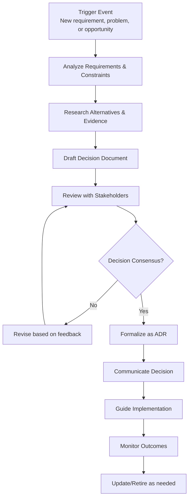
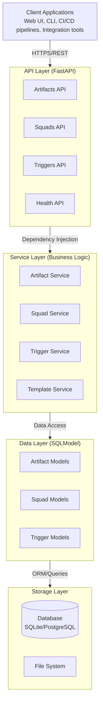
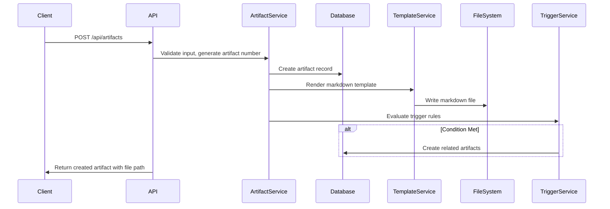
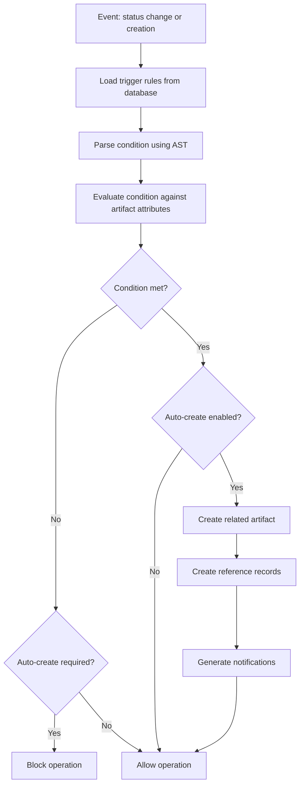
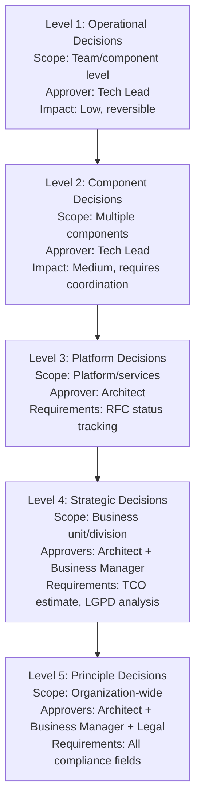

# Solutions Architect Handbook - ADR Hub

## Executive Summary

**ADR Hub** is an enterprise-grade Architecture Decision Record (ADR) management system designed to transform architecture governance from scattered markdown files into a queryable, auditable system. This handbook provides solution architects and enterprise architects with comprehensive guidance for implementing, operating, and extending the ADR Hub platform.

**Author**: Sophie Pyxis ([LinkedIn](https://www.linkedin.com/in/sophie-pyxis) | [GitHub](https://github.com/sophie-pyxis))

*Reference contributions and insights from Scarlet Rose, Solutions Architect at Itaú: [LinkedIn](https://www.linkedin.com/in/scarletrose/) | [GitHub](https://github.com/scarletquasar) | [YouTube Channel](https://www.youtube.com/watch?v=MYq4v6S8BHE)*

---

## 1. Understanding Solutions Architecture

### 1.1 What is a Solutions Architect?

A **Solutions Architect** bridges the gap between business requirements and technical implementation, translating strategic goals into actionable architectural designs. Unlike software engineers who focus on implementation details, solutions architects operate at a higher abstraction level, considering:

- **Business Context**: How technical decisions impact business outcomes
- **Technical Feasibility**: Balancing innovation with practical constraints  
- **Risk Management**: Identifying and mitigating architectural risks
- **Stakeholder Alignment**: Ensuring technical decisions satisfy all parties
- **Compliance & Governance**: Navigating regulatory and organizational constraints

### 1.2 Types of Architects in Enterprise Organizations

| Role | Primary Focus | Key Responsibilities | Decision Scope |
|------|---------------|---------------------|----------------|
| **Solutions Architect** | Business-Technology alignment | Solution design, requirement analysis, stakeholder management | Cross-system, project-level |
| **Enterprise Architect** | Strategic direction | Technology roadmap, standards, portfolio management | Organization-wide, strategic |
| **Domain Architect** | Specific business domain | Domain-specific patterns, data models, integration | Business unit, domain-focused |
| **Technical Architect** | Implementation patterns | Technical standards, coding guidelines, tech stack selection | Technology stack, team-level |
| **Cloud Architect** | Cloud infrastructure | Cloud strategy, cost optimization, platform selection | Cloud environment, infrastructure |

### 1.3 Core Competencies of Solutions Architects

1. **Technical Breadth**: Understanding multiple technologies, platforms, and patterns
2. **Business Acumen**: Translating business requirements into technical solutions
3. **Communication Skills**: Articulating complex concepts to diverse audiences
4. **Risk Assessment**: Identifying and mitigating technical and business risks
5. **Governance Navigation**: Working within organizational constraints and compliance frameworks
6. **Strategic Thinking**: Balancing immediate needs with long-term architectural vision

### 1.4 Day-to-Day Activities

A typical solutions architect's work involves:
- **Requirement Analysis**: Understanding business needs and technical constraints
- **Solution Design**: Creating architectural diagrams and specifications
- **Stakeholder Meetings**: Aligning business, development, and operations teams
- **Decision Documentation**: Capturing architectural decisions and their rationale
- **Risk Assessment**: Evaluating technical and compliance risks
- **Governance Compliance**: Ensuring solutions meet organizational standards
- **Technology Evaluation**: Assessing new tools, frameworks, and platforms

---

## 2. Artifacts Used by Solutions Architects

### 2.1 Architecture Decision Records (ADRs)

**Purpose**: Capture important architectural decisions with context, alternatives considered, and rationale.
- **Format**: Structured markdown with clear sections
- **Audience**: Development teams, future architects, auditors
- **Lifecycle**: Proposed → Accepted → Superseded → Retired

**Example Use Cases**:
- Choosing between microservices vs monolithic architecture
- Selecting a database technology (SQL vs NoSQL)
- Defining API design patterns (REST vs GraphQL)
- Establishing security protocols and compliance requirements

### 2.2 Solution Design Documents (SDDs)

**Purpose**: Comprehensive documentation of solution architecture including components, interactions, and deployment considerations.
- **Format**: Detailed document with diagrams, specifications, and constraints
- **Audience**: Development teams, project managers, stakeholders
- **Content**: Architecture diagrams, data flows, security considerations, scalability plans

### 2.3 Request for Comments (RFCs)

**Purpose**: Socialize architectural proposals for feedback before formalization.
- **Format**: Proposal document with problem statement, proposed solution, and open questions
- **Audience**: Technical community, subject matter experts
- **Process**: Draft → Review → Revised → Accepted/Rejected

### 2.4 Evidence Artifacts

**Purpose**: Support architectural decisions with data, research, or proof-of-concept results.
- **Types**: Performance benchmarks, security assessments, compliance checks, cost analysis
- **Format**: Reports, test results, analysis documents
- **Importance**: Provides objective basis for subjective architectural choices

### 2.5 Governance Artifacts

**Purpose**: Document organizational policies, standards, and compliance requirements.
- **Examples**: Security policies, data protection standards, deployment guidelines
- **Audience**: All technical teams, compliance officers
- **Enforcement**: Mandatory requirements with validation mechanisms

### 2.6 Implementation Artifacts

**Purpose**: Detailed technical specifications for development teams.
- **Content**: API specifications, data models, interface definitions, deployment scripts
- **Audience**: Development and operations teams
- **Relationship**: Derived from higher-level architectural decisions

---

## 3. Solutions Architect Workflow

### 3.1 The Architecture Decision Lifecycle



### 3.2 Stakeholder Engagement Model

Solutions architects work with multiple stakeholder groups:

| Stakeholder Group | Engagement Focus | Communication Style |
|-------------------|------------------|---------------------|
| **Business Leaders** | Value proposition, ROI, strategic alignment | Business outcomes, cost-benefit analysis |
| **Development Teams** | Implementation feasibility, technical details | Technical specifications, code examples |
| **Operations Teams** | Deployment, monitoring, maintenance | Operational requirements, SLAs |
| **Security Teams** | Risk assessment, compliance requirements | Security controls, threat models |
| **Product Managers** | Feature requirements, timelines | User stories, product roadmap |

### 3.3 Decision-Making Framework

1. **Problem Definition**: Clearly articulate the problem or opportunity
2. **Constraint Analysis**: Identify technical, business, and compliance constraints
3. **Alternative Generation**: Brainstorm multiple solution approaches
4. **Evaluation Criteria**: Define objective criteria for comparison
5. **Evidence Gathering**: Collect data to support each alternative
6. **Risk Assessment**: Evaluate risks for each option
7. **Recommendation**: Propose solution with supporting rationale
8. **Validation**: Socialize with stakeholders for feedback
9. **Documentation**: Capture decision in appropriate artifacts
10. **Communication**: Share decision with affected parties

### 3.4 Collaboration Patterns

- **Architecture Review Boards**: Formal governance bodies for significant decisions
- **Community of Practice**: Informal groups for knowledge sharing
- **Pair Designing**: Collaborative solution design sessions
- **Architecture Katas**: Practice sessions for architectural problem-solving
- **Brown Bag Sessions**: Informal knowledge sharing meetings

---

## 4. How Solutions Architects Use ADR Hub

### 4.1 Daily Operations with ADR Hub

**Morning Routine**:
1. Check dashboard for new artifacts requiring review
2. Review pending ADRs at your approval level
3. Monitor health metrics for compliance gaps
4. Respond to notifications about status changes

**Design Sessions**:
1. Create draft ADRs during architecture discussions
2. Link RFCs to ADRs for traceability
3. Attach evidence artifacts to support decisions
4. Set up triggers for automatic follow-up actions

**Review & Approval**:
1. Receive notifications for artifacts at your approval level
2. Review ADRs with embedded evidence and compliance checks
3. Provide feedback directly in the system
4. Approve/reject with documented rationale
5. Monitor approval chains for Level 4-5 decisions

**Compliance Management**:
1. Track LGPD analysis requirements for data-sensitive decisions
2. Monitor TCO estimates for cost-impacting decisions
3. Validate RFC status before approving Level 3+ ADRs
4. Generate compliance reports for audit purposes

### 4.2 Strategic Planning with ADR Hub

**Portfolio Management**:
- Analyze artifact distribution across squads and domains
- Identify knowledge gaps in architecture documentation
- Track decision evolution over time
- Monitor compliance across business units

**Risk Management**:
- Flag ADRs with incomplete compliance information
- Identify decisions approaching supersession dates
- Monitor health scores for architectural components
- Track mitigation actions for identified risks

**Knowledge Management**:
- Search historical decisions by technology, domain, or team
- Analyze decision patterns and trends
- Identify reusable architecture patterns
- Document lessons learned from past decisions

### 4.3 Team Enablement

**Onboarding New Architects**:
- Use ADR Hub as a knowledge base for architectural context
- Review historical decisions to understand architecture evolution
- Analyze decision patterns in specific domains
- Learn organizational constraints and compliance requirements

**Team Collaboration**:
- Share ADRs for peer review and feedback
- Establish consistent documentation practices
- Maintain decision traceability across teams
- Foster architecture community through shared artifacts

**Continuous Improvement**:
- Analyze decision quality metrics
- Identify documentation gaps
- Measure time-to-decision metrics
- Track stakeholder satisfaction with architecture processes

### 4.4 Real-World Scenarios

**Scenario 1: Microservices Migration Decision**
- **Problem**: Legacy monolithic application needs modernization
- **ADR Hub Usage**: 
  - Create Level 4 ADR for strategic decision
  - Attach evidence artifacts: performance benchmarks, cost analysis
  - Link RFC for community feedback
  - Complete LGPD analysis for data handling implications
  - Document TCO estimates for 3-year horizon
  - Set trigger to create implementation artifacts when approved

**Scenario 2: Database Technology Selection**
- **Problem**: Need to choose between SQL and NoSQL for new feature
- **ADR Hub Usage**:
  - Create Level 3 ADR for platform decision
  - Attach proof-of-concept results as evidence
  - Reference existing ADRs on data consistency requirements
  - Track RFC status from database community review
  - Document decision rationale for future reference

**Scenario 3: Security Protocol Update**
- **Problem**: Need to implement new authentication protocol
- **ADR Hub Usage**:
  - Create Level 5 ADR for organization-wide security decision
  - Attach security assessment reports as evidence
  - Complete comprehensive compliance checks
  - Document approval chain with security, legal, and business stakeholders
  - Create linked governance artifacts for implementation guidelines

### 4.5 Measuring Success

**Quantitative Metrics**:
- **Decision Velocity**: Time from problem identification to documented decision
- **Compliance Coverage**: Percentage of ADRs with complete compliance information
- **Artifact Utilization**: Frequency of artifact access and reference
- **Approval Cycle Time**: Time spent in review and approval processes
- **Risk Mitigation**: Number of risks identified and addressed through ADR process

**Qualitative Benefits**:
- **Reduced Rework**: Clear decisions prevent misunderstandings and reimplementation
- **Knowledge Retention**: Institutional knowledge preserved despite team changes
- **Audit Readiness**: Complete documentation trail for compliance audits
- **Stakeholder Confidence**: Transparent decision process builds trust
- **Strategic Alignment**: Technical decisions consistently support business goals

---

## 5. ADR Hub System Overview

### 5.1 Core Purpose
ADR Hub provides a unified platform for managing 7 types of architecture artifacts with automated governance workflows, trigger-based automation, and proactive health analysis.

### 5.2 Key Business Value Propositions
- **Governance Automation**: Transform manual ADR processes into automated workflows
- **Compliance Assurance**: Built-in healthcare compliance (LGPD) and regulatory tracking
- **Decision Traceability**: Full audit trail from decision to implementation
- **Risk Mitigation**: Proactive health monitoring and gap detection
- **Knowledge Management**: Centralized repository for architecture decisions and rationale

### 5.3 Strategic Alignment
- **Enterprise Architecture**: Supports TOGAF, Zachman frameworks
- **Agile Governance**: Enables architecture governance in agile environments
- **DevOps Integration**: CI/CD pipeline integration for automated compliance
- **Regulatory Compliance**: Healthcare (HIPAA/LGPD) and financial services ready

---

## 6. Architecture Principles

### 6.1 Design Principles
1. **Separation of Concerns**: Clear boundaries between API, business logic, and data access
2. **Dependency Inversion**: High-level modules don't depend on low-level implementations
3. **Testability**: All components are independently testable with dependency injection
4. **Maintainability**: Modular design with single responsibility per component
5. **Security by Design**: AST-based safe evaluation, input validation, secure defaults

### 6.2 Architecture Style
- **Clean Architecture**: Follows Robert C. Martin's Clean Architecture principles
- **REST API**: Stateless, resource-oriented API design
- **Microservices Ready**: Containerized, independently deployable components
- **Database Agnostic**: SQLite for development, PostgreSQL for production

### 6.3 Quality Attributes
| Attribute | Strategy | Implementation |
|-----------|----------|---------------|
| **Scalability** | Horizontal scaling, stateless design | FastAPI with async support, connection pooling |
| **Reliability** | Retry logic, circuit breakers, health checks | Health service, database monitoring, retry decorators |
| **Security** | Defense in depth, least privilege | AST-based evaluation, input validation, role-based access |
| **Maintainability** | Modular design, clear interfaces | Clean Architecture layers, dependency injection |
| **Performance** | Caching, efficient queries, indexing | Query optimization, Redis integration (planned) |

---

## 7. Technical Architecture

### 7.1 System Architecture



### 7.2 Component Responsibilities

#### 7.2.1 API Layer (`src/api/`)
- **Artifacts API**: CRUD operations for all 7 artifact types
- **Squads API**: Team management and lifecycle operations
- **Triggers API**: Rule definition and evaluation endpoints
- **Health API**: System monitoring and status endpoints

#### 7.2.2 Service Layer (`src/services/`)
- **ArtifactService**: Core business logic for artifact management
- **SquadService**: Team governance and ownership logic
- **TriggerService**: Rule evaluation and automation engine
- **TemplateService**: Markdown template rendering and management
- **HealthService**: System monitoring and proactive analysis

#### 7.2.3 Data Layer (`src/models/`)
- **Artifact Models**: Unified model for all artifact types
- **Squad Models**: Team structure and lifecycle management
- **Trigger Models**: Rule definitions and condition storage
- **Reference Models**: Cross-references between artifacts

### 7.3 Data Flow Patterns

#### 7.3.1 Artifact Creation Flow



#### 7.3.2 Trigger Evaluation Flow



---

## 8. Artifact Governance Framework

### 8.1 Artifact Taxonomy
| Type | Purpose | Governance Level | Lifecycle |
|------|---------|------------------|-----------|
| **ADR** | Architecture decisions | Level 1-5 | Proposed → Accepted → Superseded |
| **RFC** | Request for comments | Advisory | Draft → Review → Accepted |
| **Evidence** | Supporting evidence | Informational | Collected → Validated → Archived |
| **Governance** | Policy definitions | Mandatory | Draft → Approved → Enforced |
| **Implementation** | Technical details | Tactical | Planned → Implemented → Verified |
| **Visibility** | Observability decisions | Operational | Defined → Implemented → Monitored |
| **Uncommon** | Edge cases | Special | Documented → Reviewed → Archived |

### 8.2 ADR Level System

#### 8.2.1 Level Definitions



#### 8.2.2 Validation Matrix
| Level | Required Approvals | Compliance Fields | Business Impact |
|-------|-------------------|-------------------|-----------------|
| 1-2 | Tech Lead | None | Low-Medium |
| 3 | Architect | RFC status | Medium |
| 4-5 | Architect + Business Manager | TCO, LGPD, Health compliance | High |

### 8.3 Compliance Framework

#### 8.3.1 Healthcare Compliance (LGPD/HIPAA)
- **LGPD Analysis**: Required for Level 4-5 ADRs
- **Data Protection Impact Assessment**: Integrated into artifact templates
- **Risk Classification**: Low/Medium/High risk categorization
- **Mitigation Requirements**: Automatic tracking of compliance actions

#### 8.3.2 Financial Compliance
- **TCO Estimates**: Required for Level 4-5 ADRs
- **ROI Calculations**: Built into decision framework
- **Risk Assessment**: Integrated risk scoring

#### 8.3.3 Audit Requirements
- **Full Audit Trail**: All changes tracked with timestamps
- **Approval Chains**: Complete approval history
- **Decision Rationale**: Structured rationale documentation
- **Compliance Evidence**: Linked evidence artifacts

---

## 9. Integration Patterns

ADR Hub is currently a standalone FastAPI application running locally or on GitHub. The following integration patterns represent future capabilities that can be built on top of the existing API.

### 9.1 Current CI/CD Integration
ADR Hub includes a GitHub Actions CI/CD pipeline that runs automatically on pushes and pull requests:

```yaml
# .github/workflows/ci.yml
name: CI/CD Pipeline
on:
  push:
    branches: [ main, develop ]
  pull_request:
    branches: [ main ]

jobs:
  test:
    runs-on: ubuntu-latest
    strategy:
      matrix:
        python-version: ["3.9", "3.10", "3.11"]
    steps:
      - uses: actions/checkout@v4
      - name: Set up Python
        uses: actions/setup-python@v5
      - name: Install dependencies
        run: pip install -r requirements.txt pytest pytest-cov
      - name: Run tests with coverage
        run: python -m pytest tests/ -v --cov=src --cov-report=xml
      - name: Check coverage threshold
        run: python -m pytest tests/ --cov=src --cov-fail-under=74
  
  lint:
    runs-on: ubuntu-latest
    steps:
      - uses: actions/checkout@v4
      - name: Install linting tools
        run: pip install black flake8 isort mypy
      - name: Check code formatting with black
        run: black --check src/ tests/
      - name: Lint with flake8
        run: flake8 src/ tests/ --count --select=E9,F63,F7,F82 --show-source --statistics
      - name: Check import sorting with isort
        run: isort --check-only src/ tests/ --profile=black
  
  security:
    runs-on: ubuntu-latest
    steps:
      - uses: actions/checkout@v4
      - name: Install security tools
        run: pip install bandit safety
      - name: Run bandit security scan
        run: bandit -r src/ -f json -o bandit-report.json || true
```

### 9.2 Planned Future Integrations
The following integrations are planned for future releases and can be built using the existing REST API:

#### 9.2.1 IDE Integration (Planned)
- **VS Code Extension**: ADR creation and management directly from the editor
- **JetBrains Plugin**: Integration with IntelliJ, PyCharm, and other JetBrains IDEs
- **CLI Tool**: Command-line interface for automation and scripting

#### 9.2.2 Project Management Integration (Planned)
- **Jira Integration**: Link ADRs to Jira tickets for traceability
- **Linear Integration**: Sync with Linear issues for agile teams
- **Azure DevOps**: Integration with Azure Boards for enterprise workflows

#### 9.2.3 Documentation Integration (Planned)
- **MkDocs/ReadTheDocs**: Automatic documentation generation from artifacts
- **Confluence Integration**: Sync ADRs to Confluence for wider visibility
- **GitHub Pages**: Automatic publication of architecture documentation

### 9.3 Building Custom Integrations
The REST API provides all necessary endpoints for building custom integrations:
- **Artifact Management**: CRUD operations for all 7 artifact types
- **Search & Filtering**: Full-text search and advanced filtering
- **Health Monitoring**: System status and compliance checks
- **Trigger Automation**: Rule-based automation and notifications

Example integration code:
```python
import requests

# Create ADR via API
response = requests.post(
    "http://localhost:8000/api/artifacts",
    json={
        "artifact_type": "adr",
        "title": "Integration Example",
        "level": 3,
        "content": "Example content",
        "squad_id": 1
    }
)
```

---

## 10. Development & Local Deployment

### 10.1 Local Development Setup

ADR Hub is designed as a development tool for architecture governance, currently deployed as a local FastAPI application with SQLite database. The primary deployment model is local development with the following setup:

```bash
# 1. Clone the repository
git clone https://github.com/sophie-pyxis/adr_hub.git
cd adr_hub

# 2. Create virtual environment
python -m venv venv

# 3. Activate virtual environment
# On Windows:
venv\Scripts\activate
# On Unix/Mac:
source venv/bin/activate

# 4. Install dependencies
pip install -r requirements.txt

# 5. Initialize the database
# The database is automatically created on first run
python -c "from src.database import create_db_and_tables; create_db_and_tables()"

# 6. Run the application
python src/main.py

# Server runs at: http://localhost:8000
# API documentation: http://localhost:8000/docs
```

### 10.2 Project Structure for Local Development

```
adr_hub/
├── src/                    # Source code
│   ├── main.py            # FastAPI application entry point
│   ├── api/               # API routes
│   ├── models/            # SQLModel database models
│   ├── services/          # Business logic services
│   └── database.py        # Database configuration
├── locale/                # Local data storage
│   └── governance.db      # SQLite database (auto-created)
├── templates/             # Markdown templates for artifacts
├── architecture/          # Artifact storage directory
├── tests/                 # Test suite
├── requirements.txt       # Python dependencies
└── pytest.ini            # Test configuration
```

### 10.3 Database Configuration

The application uses SQLite for local development with automatic database creation:

```python
# src/database.py
from sqlmodel import SQLModel, create_engine, Session

# SQLite database for local development
DATABASE_URL = "sqlite:///./locale/governance.db"
engine = create_engine(DATABASE_URL, echo=True)

def create_db_and_tables():
    """Create all database tables on application startup."""
    SQLModel.metadata.create_all(engine)

def get_session():
    """Get database session for dependency injection."""
    with Session(engine) as session:
        yield session
```

### 10.4 Planned Deployment Options (Future)

**Note**: The following deployment options are planned for future development but are not currently implemented:

1. **Docker Containerization** (Planned):
   ```dockerfile
   # Example Dockerfile (planned)
   FROM python:3.11-slim
   WORKDIR /app
   COPY requirements.txt .
   RUN pip install --no-cache-dir -r requirements.txt
   COPY . .
   CMD ["python", "src/main.py"]
   ```

2. **Cloud Deployment** (Planned):
   - AWS ECS/EKS with Fargate
   - Azure App Service
   - Google Cloud Run

3. **CI/CD Pipeline** (Currently Implemented):
   - GitHub Actions for testing, linting, and security scanning
   - Automatic test execution on push/pull request
   - 74% minimum test coverage requirement

---

## 11. Security & Compliance

### 11.1 Current Security Implementation

ADR Hub is designed as a local development tool with basic security measures appropriate for its use case:

1. **Input Validation**: All API endpoints use Pydantic models for type validation
2. **SQL Injection Prevention**: SQLModel ORM with parameterized queries
3. **CORS Configuration**: Configured for local development with permissive CORS settings
4. **Environment Variables**: Configuration via environment variables (planned for future)

### 11.2 Security Controls in Development Environment

#### 11.2.1 API Security
- **Input Validation**: Pydantic models validate all API requests
- **Type Safety**: SQLModel provides type-safe database interactions
- **CORS**: Configured for local development (`allow_origins=["*"]`)
- **Error Handling**: Comprehensive error responses without exposing internal details

#### 11.2.2 Data Protection
- **Local Storage**: SQLite database stored in `locale/governance.db`
- **File Permissions**: Standard file system permissions for local development
- **Backup Strategy**: Manual backup of the database file
- **Sensitive Data**: No sensitive user data stored in the current version

#### 11.2.3 Access Control
- **Local Development**: Designed for single-user local development
- **No Authentication**: Current version does not implement user authentication
- **Team Isolation**: Squad-based data organization for logical separation
- **Future Planning**: Authentication and authorization planned for production deployment

### 11.3 Compliance Considerations for Architecture Governance

**Note**: The following compliance aspects are considered for architecture governance use cases:

1. **Documentation Security**: Architecture artifacts contain sensitive design information
2. **Audit Trail**: Artifact creation timestamps and status changes provide basic audit capability
3. **Data Retention**: Artifacts are preserved as historical documentation
4. **Access Control**: Local deployment model provides physical access control

### 11.4 Planned Security Enhancements (Future)

For production deployment, the following security features are planned:

1. **Authentication**: JWT-based authentication with role-based access control
2. **Authorization**: Fine-grained permissions for different user roles
3. **Encryption**: TLS for API communications, encryption at rest for sensitive data
4. **Audit Logging**: Comprehensive security event logging
5. **Compliance**: Support for LGPD, GDPR, SOC 2 compliance requirements

---

## 12. Monitoring & Health Checks

### 12.1 Health Monitoring Endpoints

ADR Hub includes basic health monitoring suitable for local development:

```python
# src/main.py - Health check endpoint
@app.get("/health")
def health_check():
    """Health check endpoint for monitoring."""
    return {"status": "healthy"}

# src/api/health.py - Comprehensive health endpoints
@router.get("/health/readiness")
def get_readiness():
    """Readiness check for service dependencies."""
    return {"status": "ready", "timestamp": datetime.utcnow().isoformat()}

@router.get("/health/liveness")
def get_liveness():
    """Liveness check for service availability."""
    return {"status": "live", "timestamp": datetime.utcnow().isoformat()}

@router.get("/health/detailed")
def get_detailed_health():
    """Detailed health status with component checks."""
    return health_service.get_overall_health()
```

### 12.2 Health Service Implementation

The health service provides comprehensive monitoring for local development:

```python
# src/services/health_service.py - Database health check
def check_database_health(self) -> Dict[str, Any]:
    """Check database health by executing a simple query."""
    start_time = time.time()
    
    try:
        # Execute a simple query to check database connectivity
        db_result = self.session.execute(select(1))
        value = db_result.scalar()
        
        if value == 1:
            status = HealthStatus.HEALTHY
            error = None
        else:
            status = HealthStatus.UNHEALTHY
            error = "Database query returned unexpected result"
            
    except Exception as e:
        status = HealthStatus.UNHEALTHY
        error = str(e)
    
    response_time_ms = (time.time() - start_time) * 1000
    
    result: Dict[str, Any] = {
        "name": "database",
        "status": status,
        "response_time_ms": round(response_time_ms, 2),
    }
    
    if error:
        result["error"] = error
    
    return result
```

### 12.3 Component Health Checks

The health service performs checks on all system components:

1. **Database Health**: Connection test and query performance
2. **Template Directory**: Verifies template files are accessible
3. **Artifact Statistics**: Counts artifacts by type and status
4. **System Metrics**: Database size, recent artifact counts

### 12.4 Health Status Response Format

```json
{
  "status": "healthy",
  "timestamp": "2024-01-15T10:30:00Z",
  "components": [
    {
      "name": "database",
      "status": "healthy",
      "response_time_ms": 12.34
    },
    {
      "name": "templates",
      "status": "healthy",
      "directory_exists": true,
      "directory_path": "/path/to/templates"
    },
    {
      "name": "artifacts",
      "status": "healthy",
      "total_count": 42,
      "by_type": {"adr": 10, "rfc": 5, "evidence": 27},
      "by_status": {"proposed": 15, "accepted": 25, "rejected": 2}
    }
  ]
}
```

### 12.5 Planned Monitoring Enhancements (Future)

For production deployment, the following monitoring features are planned:

1. **Prometheus Integration**: Metrics collection and visualization
2. **Structured Logging**: JSON-formatted logs with correlation IDs
3. **Alerting System**: Threshold-based alerts for critical metrics
4. **Performance Monitoring**: API latency, database query performance
5. **Business Metrics**: Artifact creation rates, approval workflows

---

## 13. Local Operations & Maintenance

### 13.1 Daily Development Operations

For local development with ADR Hub, follow these operational procedures:

1. **Starting the Application**:
   ```bash
   # Activate virtual environment
   venv\Scripts\activate  # Windows
   source venv/bin/activate  # Unix/Mac
   
   # Start the FastAPI server
   python src/main.py
   
   # Server runs at: http://localhost:8000
   # API docs: http://localhost:8000/docs
   ```

2. **Database Operations**:
   ```bash
   # Database is automatically created on first run
   # Manual initialization (if needed):
   python -c "from src.database import create_db_and_tables; create_db_and_tables()"
   
   # Database file location: ./locale/governance.db
   ```

3. **Testing Operations**:
   ```bash
   # Run all tests
   python -m pytest tests/ -v
   
   # Run tests with coverage
   python -m pytest tests/ -v --cov=src --cov-report=html
   
   # Minimum coverage requirement: 74%
   ```

### 13.2 Backup & Data Management

Since ADR Hub runs locally, data management follows standard local development practices:

1. **Database Backup**:
   ```bash
   # Manual backup of SQLite database
   cp ./locale/governance.db ./locale/governance.db.backup-$(date +%Y%m%d)
   
   # Restore from backup
   cp ./locale/governance.db.backup-20240115 ./locale/governance.db
   ```

2. **Artifact Files Backup**:
   ```bash
   # Artifact markdown files are stored in ./architecture/
   # Back up the entire architecture directory
   tar -czf architecture-backup-$(date +%Y%m%d).tar.gz architecture/
   ```

3. **Version Control Integration**:
   - All artifacts are version-controlled via Git
   - Database should NOT be committed to Git (in .gitignore)
   - Regular commits for artifact changes

### 13.3 Troubleshooting Common Issues

| Issue | Symptoms | Resolution |
|-------|----------|------------|
| Database connection error | "sqlite3.OperationalError: unable to open database file" | Check file permissions on `./locale/governance.db` |
| Port already in use | "Address already in use" | Change port in `src/main.py` or kill existing process |
| Missing dependencies | "ModuleNotFoundError" | Run `pip install -r requirements.txt` |
| Template file not found | "FileNotFoundError" | Ensure `templates/` directory exists with template files |

### 13.4 Maintenance Procedures

1. **Dependency Updates**:
   ```bash
   # Update Python dependencies
   pip install --upgrade -r requirements.txt
   
   # Check for security vulnerabilities
   safety check
   ```

2. **Code Quality Maintenance**:
   ```bash
   # Format code with black
   black src/ tests/
   
   # Check imports with isort
   isort src/ tests/ --profile=black
   
   # Lint with flake8
   flake8 src/ tests/ --count --select=E9,F63,F7,F82 --show-source --statistics
   ```

3. **Database Maintenance**:
   - SQLite requires minimal maintenance
   - Periodically run `VACUUM` if database grows large
   - Monitor disk space for `./locale/governance.db`

### 13.5 Planned Operational Enhancements (Future)

For production deployment, the following operational procedures are planned:

1. **Automated Deployments**: CI/CD pipeline with automated testing
2. **Database Migrations**: Versioned schema migrations
3. **Monitoring & Alerting**: Production-grade monitoring
4. **Backup Automation**: Scheduled backups with retention policies

---

## 14. Extension & Customization

### 14.1 Current Extension Points

The current ADR Hub implementation provides several built-in extension mechanisms:

1. **7 Predefined Artifact Types**: The system supports 7 fixed artifact types:
   - `adr`: Architecture Decision Records
   - `rfc`: Requests for Comments
   - `evidence`: Technical evidence and proofs
   - `governance`: Governance and compliance documents
   - `implementation`: Implementation plans and technical specifications
   - `visibility`: Visibility and communication artifacts
   - `uncommon`: Specialized artifacts for unique scenarios

2. **Trigger Engine**: Custom business logic can be implemented using the trigger system:
   - Rule-based automation using Python expressions
   - Automatic artifact creation based on conditions
   - Status transition validation rules

3. **Template System**: Custom Markdown templates can be added to the `/templates` directory.

### 14.2 Planned Extension Features (Future Roadmap)

The following extension capabilities are planned for future releases:

#### Plugin Architecture (Planned)
```python
# Planned plugin interface concept
class ADRPlugin(ABC):
    """Base class for ADR Hub plugins."""
    
    def on_artifact_created(self, artifact: Artifact) -> None:
        """Called when an artifact is created."""
        pass
    
    def on_status_changed(self, artifact: Artifact, old_status: str) -> None:
        """Called when artifact status changes."""
        pass
```

#### Custom Artifact Types (Planned)
Future versions may allow defining custom artifact types with specialized fields and validation rules.

#### Integration Extensions (Planned)
- **Export Formats**: PDF, Word, Excel export functionality
- **External System Sync**: Integration with Jira, ServiceNow, Salesforce
- **Notification Channels**: Slack, Microsoft Teams, Email notifications
- **Analytics Integration**: Power BI, Tableau, Looker dashboards

---

## 15. Roadmap & Evolution

### 15.1 Current Implementation
The ADR Hub currently provides:
- **7 Artifact Types**: Fixed set of architecture governance artifacts
- **Clean Architecture**: API, Service, and Models layers
- **SQLite Database**: Local development database with SQLModel ORM
- **Trigger Engine**: Safe AST-based rule evaluation system
- **Health Monitoring**: Database and template directory health checks
- **REST API**: Full CRUD operations for artifacts, squads, and triggers
- **Local Development**: Complete local setup with virtual environment

### 15.2 Short-term (Next 3 months)
- [ ] **Authentication**: JWT with role-based access (Architect/TechLead/Viewer roles)
- [ ] **Export Functionality**: PDF export for artifacts
- [ ] **Database Migrations**: Alembic migrations for PostgreSQL compatibility
- [ ] **Webhook Notifications**: Status change notifications to external systems

### 15.3 Medium-term (3-6 months)
- [ ] **Modern FastAPI Patterns**: Transition from `on_event` to `lifespan` context managers
- [ ] **Enhanced Validation**: Full migration to Pydantic v2 patterns and settings
- [ ] **API Protection**: Rate limiting and API throttling controls
- [ ] **Search Enhancements**: Advanced search with filtering capabilities
- [ ] **Collaboration Features**: Basic real-time collaboration support

### 15.4 Long-term (6+ months)
- [ ] **GraphQL API**: GraphQL endpoint alongside REST API
- [ ] **ML Suggestions**: Machine learning for artifact suggestions and patterns
- [ ] **Tool Integration**: Integration with Jira, Linear, and other project management tools
- [ ] **Mobile Access**: Mobile-optimized interface or application
- [ ] **Advanced Analytics**: Business intelligence and reporting dashboards

---

## 16. References & Resources

### 16.1 Documentation
- [API Documentation](http://localhost:8000/docs) (when running locally)
- [GitHub Repository](https://github.com/sophie-pyxis/adr_hub)
- [Architecture Decision Records Guide](https://adr.github.io/)

### 16.2 Tools & Libraries
- **FastAPI**: Modern web framework for APIs
- **SQLModel**: SQL databases in Python, designed for simplicity (includes automatic table creation)
- **Pydantic**: Data validation using Python type annotations
- **SQLAlchemy**: Underlying ORM for database operations
- **Pytest**: Testing framework with coverage reporting

### 16.3 Standards & Frameworks
- **TOGAF**: The Open Group Architecture Framework
- **Zachman Framework**: Enterprise architecture framework
- **ISO/IEC 42010**: Systems and software engineering — Architecture description
- **NIST Cybersecurity Framework**

---

## 17. Appendix

### 17.1 Glossary
- **ADR**: Architecture Decision Record
- **RFC**: Request for Comments
- **LGPD**: Lei Geral de Proteção de Dados (Brazilian GDPR)
- **TCO**: Total Cost of Ownership
- **Squad**: Development team with artifact ownership

### 17.2 Acronyms
- **API**: Application Programming Interface
- **AST**: Abstract Syntax Tree
- **CI/CD**: Continuous Integration/Continuous Deployment
- **RBAC**: Role-Based Access Control
- **RTO**: Recovery Time Objective
- **RPO**: Recovery Point Objective

### 17.3 Change Log
| Version | Date | Changes |
|---------|------|---------|
| 1.0.0 | 2026-04-08 | Initial release of Solutions Architect Handbook |
| 1.1.0 | Planned | Add operational procedures, security controls |

---

## 18. Contact & Support

### 18.1 Support Channels
- **GitHub Issues**: [Report bugs or request features](https://github.com/sophie-pyxis/adr_hub/issues)
- **Documentation**: Check the `/docs` endpoint when running the API
- **Community**: Join discussions in GitHub Discussions

### 18.2 Escalation Path
1. **Level 1**: Documentation and community support
2. **Level 2**: GitHub issues for bugs and feature requests
3. **Level 3**: Direct repository maintainer contact (for critical issues)

---

## Acknowledgments

Special thanks to:

- **Scarlet Rose**, Solutions Architect at Itaú, for sharing valuable insights about solutions architecture through her YouTube channel and social media
- **The FastAPI community** for creating an excellent framework
- **The ADR community** for establishing best practices in architecture decision documentation

---

**ADR Hub Solutions Architect Handbook** — Version 1.0.0  
Created by: Sophie Pyxis ([LinkedIn](https://www.linkedin.com/in/sophie-pyxis) | [GitHub](https://github.com/sophie-pyxis))  
Last Updated: 2026-04-08  
© 2026 Sophie Pyxis. All rights reserved.