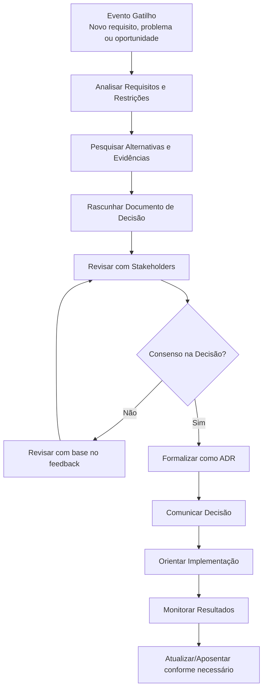
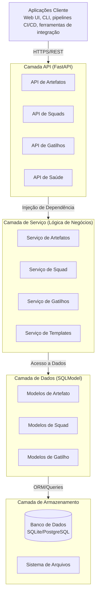
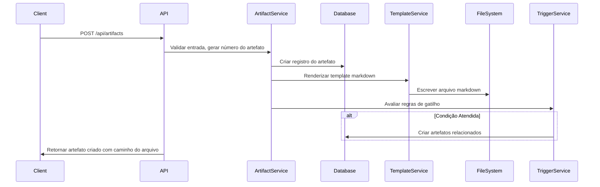
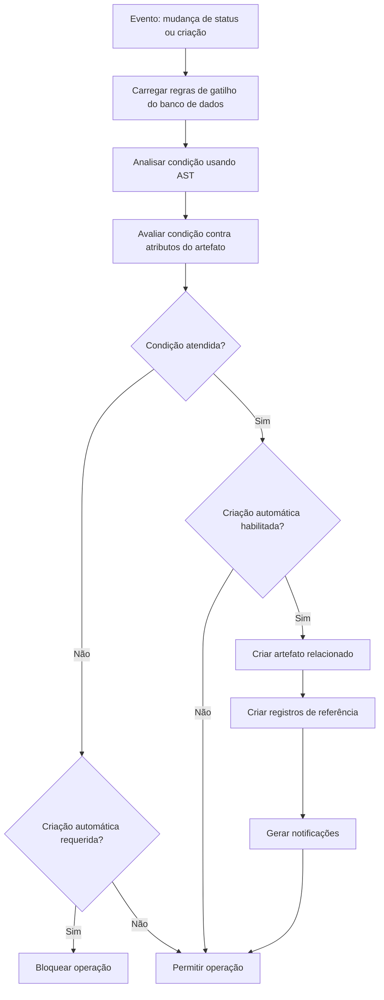
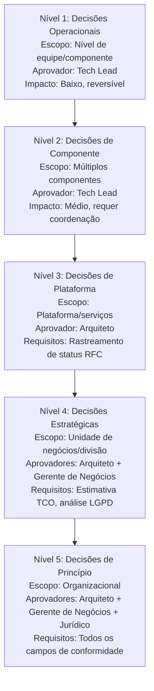

# Manual do Arquiteto de Soluções - ADR Hub

## Resumo Executivo

**ADR Hub** é um sistema de gerenciamento de Registros de Decisões de Arquitetura (ADR) de nível corporativo, projetado para transformar a governança de arquitetura de arquivos markdown dispersos em um sistema consultável e auditável. Este manual fornece aos arquitetos de soluções e arquitetos empresariais orientações abrangentes para implementar, operar e estender a plataforma ADR Hub.

**Autora**: Sophie Pyxis ([LinkedIn](https://www.linkedin.com/in/sophie-pyxis) | [GitHub](https://github.com/sophie-pyxis))

*Contribuições e insights de Scarlet Rose, Arquiteta de Soluções no Itaú: [LinkedIn](https://www.linkedin.com/in/scarletrose/) | [GitHub](https://github.com/scarletquasar) | [Canal do YouTube](https://www.youtube.com/watch?v=MYq4v6S8BHE)*

---

## 1. Compreendendo a Arquitetura de Soluções

### 1.1 O que é um Arquiteto de Soluções?

Um **Arquiteto de Soluções** faz a ponte entre os requisitos de negócios e a implementação técnica, traduzindo objetivos estratégicos em projetos arquiteturais executáveis. Diferente dos engenheiros de software que se concentram em detalhes de implementação, os arquitetos de soluções operam em um nível de abstração mais alto, considerando:

- **Contexto de Negócios**: Como as decisões técnicas impactam os resultados do negócio
- **Viabilidade Técnica**: Equilibrando inovação com restrições práticas
- **Gestão de Riscos**: Identificando e mitigando riscos arquiteturais
- **Alinhamento de Stakeholders**: Garantindo que decisões técnicas satisfaçam todas as partes
- **Conformidade e Governança**: Navegando por restrições regulatórias e organizacionais

### 1.2 Tipos de Arquitetos em Organizações Empresariais

| Papel | Foco Principal | Responsabilidades Chave | Escopo de Decisão |
|------|---------------|---------------------|----------------|
| **Arquiteto de Soluções** | Alinhamento Negócio-Tecnologia | Projeto de solução, análise de requisitos, gestão de stakeholders | Trans-sistema, nível de projeto |
| **Arquiteto Empresarial** | Direcionamento estratégico | Roadmap de tecnologia, padrões, gestão de portfólio | Organizacional, estratégico |
| **Arquiteto de Domínio** | Domínio de negócio específico | Padrões específicos do domínio, modelos de dados, integração | Unidade de negócios, foco em domínio |
| **Arquiteto Técnico** | Padrões de implementação | Padrões técnicos, diretrizes de codificação, seleção de stack tecnológico | Stack tecnológico, nível de equipe |
| **Arquiteto de Nuvem** | Infraestrutura de nuvem | Estratégia de nuvem, otimização de custos, seleção de plataforma | Ambiente de nuvem, infraestrutura |

### 1.3 Competências Essenciais dos Arquitetos de Soluções

1. **Amplitude Técnica**: Compreensão de múltiplas tecnologias, plataformas e padrões
2. **Acuidade de Negócios**: Traduzindo requisitos de negócios em soluções técnicas
3. **Habilidades de Comunicação**: Articulando conceitos complexos para públicos diversos
4. **Avaliação de Riscos**: Identificando e mitigando riscos técnicos e de negócios
5. **Navegação em Governança**: Trabalhando dentro de restrições organizacionais e frameworks de conformidade
6. **Pensamento Estratégico**: Equilibrando necessidades imediatas com visão arquitetural de longo prazo

### 1.4 Atividades Diárias

O trabalho típico de um arquiteto de soluções envolve:
- **Análise de Requisitos**: Compreendendo necessidades de negócios e restrições técnicas
- **Projeto de Solução**: Criando diagramas arquiteturais e especificações
- **Reuniões com Stakeholders**: Alinhando equipes de negócios, desenvolvimento e operações
- **Documentação de Decisões**: Capturando decisões arquiteturais e sua justificativa
- **Avaliação de Riscos**: Avaliando riscos técnicos e de conformidade
- **Conformidade com Governança**: Garantindo que soluções atendam aos padrões organizacionais
- **Avaliação de Tecnologia**: Avaliando novas ferramentas, frameworks e plataformas

---

## 2. Artefatos Utilizados por Arquitetos de Soluções

### 2.1 Registros de Decisão de Arquitetura (ADRs)

**Propósito**: Capturar decisões arquiteturais importantes com contexto, alternativas consideradas e justificativa.
- **Formato**: Markdown estruturado com seções claras
- **Público**: Equipes de desenvolvimento, arquitetos futuros, auditores
- **Ciclo de Vida**: Proposto → Aceito → Substituído → Aposentado

**Casos de Uso Exemplo**:
- Escolha entre arquitetura de microsserviços vs monolítica
- Seleção de tecnologia de banco de dados (SQL vs NoSQL)
- Definição de padrões de design de API (REST vs GraphQL)
- Estabelecimento de protocolos de segurança e requisitos de conformidade

### 2.2 Documentos de Design de Solução (SDDs)

**Propósito**: Documentação abrangente da arquitetura de solução incluindo componentes, interações e considerações de implantação.
- **Formato**: Documento detalhado com diagramas, especificações e restrições
- **Público**: Equipes de desenvolvimento, gerentes de projeto, stakeholders
- **Conteúdo**: Diagramas de arquitetura, fluxos de dados, considerações de segurança, planos de escalabilidade

### 2.3 Solicitação de Comentários (RFCs)

**Propósito**: Socializar propostas arquiteturais para feedback antes da formalização.
- **Formato**: Documento de proposta com declaração de problema, solução proposta e questões abertas
- **Público**: Comunidade técnica, especialistas no assunto
- **Processo**: Rascunho → Revisão → Revisado → Aceito/Rejeitado

### 2.4 Artefatos de Evidência

**Propósito**: Apoiar decisões arquiteturais com dados, pesquisa ou resultados de prova de conceito.
- **Tipos**: Benchmarks de performance, avaliações de segurança, verificações de conformidade, análise de custos
- **Formato**: Relatórios, resultados de testes, documentos de análise
- **Importância**: Fornece base objetiva para escolhas arquiteturais subjetivas

### 2.5 Artefatos de Governança

**Propósito**: Documentar políticas organizacionais, padrões e requisitos de conformidade.
- **Exemplos**: Políticas de segurança, padrões de proteção de dados, diretrizes de implantação
- **Público**: Todas as equipes técnicas, oficiais de conformidade
- **Aplicação**: Requisitos obrigatórios com mecanismos de validação

### 2.6 Artefatos de Implementação

**Propósito**: Especificações técnicas detalhadas para equipes de desenvolvimento.
- **Conteúdo**: Especificações de API, modelos de dados, definições de interface, scripts de implantação
- **Público**: Equipes de desenvolvimento e operações
- **Relação**: Derivados de decisões arquiteturais de nível superior

---

## 3. Fluxo de Trabalho do Arquiteto de Soluções

### 3.1 O Ciclo de Vida da Decisão de Arquitetura



### 3.2 Modelo de Engajamento de Stakeholders

Arquitetos de soluções trabalham com múltiplos grupos de stakeholders:

| Grupo de Stakeholders | Foco de Engajamento | Estilo de Comunicação |
|-------------------|------------------|---------------------|
| **Líderes de Negócios** | Proposta de valor, ROI, alinhamento estratégico | Resultados de negócios, análise de custo-benefício |
| **Equipes de Desenvolvimento** | Viabilidade de implementação, detalhes técnicos | Especificações técnicas, exemplos de código |
| **Equipes de Operações** | Implantação, monitoramento, manutenção | Requisitos operacionais, SLAs |
| **Equipes de Segurança** | Avaliação de risco, requisitos de conformidade | Controles de segurança, modelos de ameaça |
| **Gerentes de Produto** | Requisitos de funcionalidades, cronogramas | Histórias de usuário, roadmap do produto |

### 3.3 Framework de Tomada de Decisão

1. **Definição do Problema**: Articular claramente o problema ou oportunidade
2. **Análise de Restrições**: Identificar restrições técnicas, de negócios e de conformidade
3. **Geração de Alternativas**: Brainstorm de múltiplas abordagens de solução
4. **Critérios de Avaliação**: Definir critérios objetivos para comparação
5. **Coleta de Evidências**: Coletar dados para apoiar cada alternativa
6. **Avaliação de Riscos**: Avaliar riscos para cada opção
7. **Recomendação**: Propor solução com justificativa de apoio
8. **Validação**: Socializar com stakeholders para feedback
9. **Documentação**: Capturar decisão em artefatos apropriados
10. **Comunicação**: Compartilhar decisão com partes afetadas

### 3.4 Padrões de Colaboração

- **Conselhos de Revisão de Arquitetura**: Órgãos de governança formal para decisões significativas
- **Comunidade de Prática**: Grupos informais para compartilhamento de conhecimento
- **Design em Par**: Sessões colaborativas de design de solução
- **Katas de Arquitetura**: Sessões de prática para resolução de problemas arquiteturais
- **Sessões Brown Bag**: Reuniões informais de compartilhamento de conhecimento

---

## 4. Como Arquitetos de Soluções Usam o ADR Hub

### 4.1 Operações Diárias com o ADR Hub

**Rotina Matinal**:
1. Verificar dashboard por novos artefatos requerendo revisão
2. Revisar ADRs pendentes no seu nível de aprovação
3. Monitorar métricas de saúde para lacunas de conformidade
4. Responder a notificações sobre mudanças de status

**Sessões de Design**:
1. Criar rascunhos de ADRs durante discussões de arquitetura
2. Vincular RFCs a ADRs para rastreabilidade
3. Anexar artefatos de evidência para apoiar decisões
4. Configurar gatilhos para ações de acompanhamento automático

**Revisão e Aprovação**:
1. Receber notificações para artefatos no seu nível de aprovação
2. Revisar ADRs com evidências incorporadas e verificações de conformidade
3. Fornecer feedback diretamente no sistema
4. Aprovar/rejeitar com justificativa documentada
5. Monitorar cadeias de aprovação para decisões Nível 4-5

**Gestão de Conformidade**:
1. Acompanhar requisitos de análise LGPD para decisões sensíveis a dados
2. Monitorar estimativas TCO para decisões impactantes em custos
3. Validar status RFC antes de aprovar ADRs Nível 3+
4. Gerar relatórios de conformidade para fins de auditoria

### 4.2 Planejamento Estratégico com o ADR Hub

**Gestão de Portfólio**:
- Analisar distribuição de artefatos entre squads e domínios
- Identificar lacunas de conhecimento na documentação de arquitetura
- Acompanhar evolução de decisões ao longo do tempo
- Monitorar conformidade entre unidades de negócios

**Gestão de Riscos**:
- Sinalizar ADRs com informações de conformidade incompletas
- Identificar decisões se aproximando de datas de substituição
- Monitorar pontuações de saúde para componentes arquiteturais
- Acompanhar ações de mitigação para riscos identificados

**Gestão do Conhecimento**:
- Pesquisar decisões históricas por tecnologia, domínio ou equipe
- Analisar padrões e tendências de decisões
- Identificar padrões de arquitetura reutilizáveis
- Documentar lições aprendidas de decisões passadas

### 4.3 Habilitação de Equipes

**Integração de Novos Arquitetos**:
- Usar ADR Hub como base de conhecimento para contexto arquitetural
- Revisar decisões históricas para entender evolução da arquitetura
- Analisar padrões de decisão em domínios específicos
- Aprender restrições organizacionais e requisitos de conformidade

**Colaboração em Equipe**:
- Compartilhar ADRs para revisão por pares e feedback
- Estabelecer práticas consistentes de documentação
- Manter rastreabilidade de decisões entre equipes
- Fomentar comunidade de arquitetura através de artefatos compartilhados

**Melhoria Contínua**:
- Analisar métricas de qualidade de decisões
- Identificar lacunas de documentação
- Medir métricas de tempo-para-decisão
- Acompanhar satisfação de stakeholders com processos de arquitetura

### 4.4 Cenários do Mundo Real

**Cenário 1: Decisão de Migração para Microsserviços**
- **Problema**: Aplicação monolítica legada precisa de modernização
- **Uso do ADR Hub**:
  - Criar ADR Nível 4 para decisão estratégica
  - Anexar artefatos de evidência: benchmarks de performance, análise de custos
  - Vincular RFC para feedback da comunidade
  - Completar análise LGPD para implicações de manipulação de dados
  - Documentar estimativas TCO para horizonte de 3 anos
  - Configurar gatilho para criar artefatos de implementação quando aprovado

**Cenário 2: Seleção de Tecnologia de Banco de Dados**
- **Problema**: Necessidade de escolher entre SQL e NoSQL para nova funcionalidade
- **Uso do ADR Hub**:
  - Criar ADR Nível 3 para decisão de plataforma
  - Anexar resultados de prova de conceito como evidência
  - Referenciar ADRs existentes sobre requisitos de consistência de dados
  - Acompanhar status RFC da revisão da comunidade de banco de dados
  - Documentar justificativa da decisão para referência futura

**Cenário 3: Atualização de Protocolo de Segurança**
- **Problema**: Necessidade de implementar novo protocolo de autenticação
- **Uso do ADR Hub**:
  - Criar ADR Nível 5 para decisão organizacional de segurança
  - Anexar relatórios de avaliação de segurança como evidência
  - Completar verificações abrangentes de conformidade
  - Documentar cadeia de aprovação com stakeholders de segurança, jurídico e negócios
  - Criar artefatos de governança vinculados para diretrizes de implementação

### 4.5 Medindo o Sucesso

**Métricas Quantitativas**:
- **Velocidade de Decisão**: Tempo desde identificação do problema até decisão documentada
- **Cobertura de Conformidade**: Porcentagem de ADRs com informações completas de conformidade
- **Utilização de Artefatos**: Frequência de acesso e referência a artefatos
- **Tempo do Ciclo de Aprovação**: Tempo gasto em processos de revisão e aprovação
- **Mitigação de Riscos**: Número de riscos identificados e tratados através do processo ADR

**Benefícios Qualitativos**:
- **Redução de Retrabalho**: Decisões claras previnem mal-entendidos e reimplementação
- **Retenção de Conhecimento**: Conhecimento institucional preservado apesar de mudanças na equipe
- **Preparação para Auditoria**: Trilha completa de documentação para auditorias de conformidade
- **Confiança dos Stakeholders**: Processo transparente de decisão constrói confiança
- **Alinhamento Estratégico**: Decisões técnicas consistentemente apoiam objetivos de negócios

---

## 5. Visão Geral do Sistema ADR Hub

### 5.1 Propósito Central
ADR Hub fornece uma plataforma unificada para gerenciar 7 tipos de artefatos de arquitetura com fluxos de trabalho automatizados de governança, automação baseada em gatilhos e análise proativa de saúde.

### 5.2 Propostas de Valor de Negócios Chave
- **Automação de Governança**: Transformar processos manuais de ADR em fluxos de trabalho automatizados
- **Garantia de Conformidade**: Conformidade de saúde incorporada (LGPD) e rastreamento regulatório
- **Rastreabilidade de Decisões**: Trilha de auditoria completa desde decisão até implementação
- **Mitigação de Riscos**: Monitoramento proativo de saúde e detecção de lacunas
- **Gestão do Conhecimento**: Repositório centralizado para decisões arquiteturais e justificativas

### 5.3 Alinhamento Estratégico
- **Arquitetura Empresarial**: Suporta frameworks TOGAF, Zachman
- **Governança Ágil**: Permite governança de arquitetura em ambientes ágeis
- **Integração DevOps**: Integração de pipeline CI/CD para conformidade automatizada
- **Conformidade Regulatória**: Pronto para saúde (HIPAA/LGPD) e serviços financeiros

---

## 6. Princípios de Arquitetura

### 6.1 Princípios de Design
1. **Separação de Responsabilidades**: Limites claros entre API, lógica de negócios e acesso a dados
2. **Inversão de Dependência**: Módulos de alto nível não dependem de implementações de baixo nível
3. **Testabilidade**: Todos os componentes são independentemente testáveis com injeção de dependência
4. **Manutenibilidade**: Design modular com responsabilidade única por componente
5. **Segurança por Design**: Avaliação segura baseada em AST, validação de entrada, padrões seguros

### 6.2 Estilo de Arquitetura
- **Arquitetura Limpa**: Segue princípios de Arquitetura Limpa de Robert C. Martin
- **API REST**: Design de API sem estado e orientado a recursos
- **Pronto para Microsserviços**: Componentes conteinerizados e independentemente implantáveis
- **Agnóstico de Banco de Dados**: SQLite para desenvolvimento, PostgreSQL para produção

### 6.3 Atributos de Qualidade
| Atributo | Estratégia | Implementação |
|-----------|----------|---------------|
| **Escalabilidade** | Escalabilidade horizontal, design sem estado | FastAPI com suporte async, pool de conexões |
| **Confiabilidade** | Lógica de repetição, circuit breakers, health checks | Serviço de saúde, monitoramento de banco de dados, decoradores de repetição |
| **Segurança** | Defesa em profundidade, privilégio mínimo | Avaliação baseada em AST, validação de entrada, acesso baseado em função |
| **Manutenibilidade** | Design modular, interfaces claras | Camadas de Arquitetura Limpa, injeção de dependência |
| **Performance** | Cache, queries eficientes, indexação | Otimização de queries, integração Redis (planejada) |

---

## 7. Arquitetura Técnica

### 7.1 Arquitetura do Sistema



### 7.2 Responsabilidades dos Componentes

#### 7.2.1 Camada API (`src/api/`)
- **API de Artefatos**: Operações CRUD para todos os 7 tipos de artefatos
- **API de Squads**: Gerenciamento de equipes e operações de ciclo de vida
- **API de Gatilhos**: Definição de regras e endpoints de avaliação
- **API de Saúde**: Monitoramento do sistema e endpoints de status

#### 7.2.2 Camada de Serviço (`src/services/`)
- **ArtifactService**: Lógica de negócios central para gerenciamento de artefatos
- **SquadService**: Lógica de governança de equipes e propriedade
- **TriggerService**: Motor de avaliação de regras e automação
- **TemplateService**: Renderização e gerenciamento de templates markdown
- **HealthService**: Monitoramento do sistema e análise proativa

#### 7.2.3 Camada de Dados (`src/models/`)
- **Modelos de Artefato**: Modelo unificado para todos os tipos de artefatos
- **Modelos de Squad**: Gerenciamento de estrutura e ciclo de vida de equipes
- **Modelos de Gatilho**: Definições de regras e armazenamento de condições
- **Modelos de Referência**: Referências cruzadas entre artefatos

### 7.3 Padrões de Fluxo de Dados

#### 7.3.1 Fluxo de Criação de Artefato



#### 7.3.2 Fluxo de Avaliação de Gatilho



---

## 8. Framework de Governança de Artefatos

### 8.1 Taxonomia de Artefatos
| Tipo | Propósito | Nível de Governança | Ciclo de Vida |
|------|---------|------------------|-----------|
| **ADR** | Decisões de arquitetura | Nível 1-5 | Proposto → Aceito → Substituído |
| **RFC** | Solicitação de comentários | Consultivo | Rascunho → Revisão → Aceito |
| **Evidência** | Evidência de apoio | Informativo | Coletado → Validado → Arquivado |
| **Governança** | Definições de política | Obrigatório | Rascunho → Aprovado → Aplicado |
| **Implementação** | Detalhes técnicos | Tático | Planejado → Implementado → Verificado |
| **Visibilidade** | Decisões de observabilidade | Operacional | Definido → Implementado → Monitorado |
| **Incomum** | Casos de borda | Especial | Documentado → Revisado → Arquivado |

### 8.2 Sistema de Níveis ADR

#### 8.2.1 Definições de Nível



#### 8.2.2 Matriz de Validação
| Nível | Aprovações Requeridas | Campos de Conformidade | Impacto no Negócio |
|-------|-------------------|-------------------|-----------------|
| 1-2 | Tech Lead | Nenhum | Baixo-Médio |
| 3 | Arquiteto | Status RFC | Médio |
| 4-5 | Arquiteto + Gerente de Negócios | TCO, LGPD, conformidade de saúde | Alto |

### 8.3 Framework de Conformidade

#### 8.3.1 Conformidade de Saúde (LGPD/HIPAA)
- **Análise LGPD**: Requerida para ADRs Nível 4-5
- **Avaliação de Impacto na Proteção de Dados**: Integrada em templates de artefatos
- **Classificação de Risco**: Categorização de risco Baixo/Médio/Alto
- **Requisitos de Mitigação**: Acompanhamento automático de ações de conformidade

#### 8.3.2 Conformidade Financeira
- **Estimativas TCO**: Requeridas para ADRs Nível 4-5
- **Cálculos ROI**: Incorporados no framework de decisão
- **Avaliação de Riscos**: Pontuação de risco integrada

#### 8.3.3 Requisitos de Auditoria
- **Trilha de Auditoria Completa**: Todas as alterações rastreadas com timestamps
- **Cadeias de Aprovação**: Histórico completo de aprovação
- **Justificativa da Decisão**: Documentação estruturada da justificativa
- **Evidência de Conformidade**: Artefatos de evidência vinculados

---

## 9. Padrões de Integração

ADR Hub é atualmente uma aplicação FastAPI independente executando localmente ou no GitHub. Os seguintes padrões de integração representam capacidades futuras que podem ser construídas sobre a API existente.

### 9.1 Integração CI/CD Atual
ADR Hub inclui um pipeline GitHub Actions CI/CD que é executado automaticamente em pushes e pull requests:

```yaml
# .github/workflows/ci.yml
name: Pipeline CI/CD
on:
  push:
    branches: [ main, develop ]
  pull_request:
    branches: [ main ]

jobs:
  test:
    runs-on: ubuntu-latest
    strategy:
      matrix:
        python-version: ["3.9", "3.10", "3.11"]
    steps:
      - uses: actions/checkout@v4
      - name: Configurar Python
        uses: actions/setup-python@v5
      - name: Instalar dependências
        run: pip install -r requirements.txt pytest pytest-cov
      - name: Executar testes com cobertura
        run: python -m pytest tests/ -v --cov=src --cov-report=xml
      - name: Verificar limiar de cobertura
        run: python -m pytest tests/ --cov=src --cov-fail-under=74
  
  lint:
    runs-on: ubuntu-latest
    steps:
      - uses: actions/checkout@v4
      - name: Instalar ferramentas de linting
        run: pip install black flake8 isort mypy
      - name: Verificar formatação de código com black
        run: black --check src/ tests/
      - name: Lint com flake8
        run: flake8 src/ tests/ --count --select=E9,F63,F7,F82 --show-source --statistics
      - name: Verificar ordenação de imports com isort
        run: isort --check-only src/ tests/ --profile=black
  
  security:
    runs-on: ubuntu-latest
    steps:
      - uses: actions/checkout@v4
      - name: Instalar ferramentas de segurança
        run: pip install bandit safety
      - name: Executar scan de segurança bandit
        run: bandit -r src/ -f json -o bandit-report.json || true
```

### 9.2 Integrações Futuras Planejadas
As seguintes integrações são planejadas para versões futuras e podem ser construídas usando a API REST existente:

#### 9.2.1 Integração com IDE (Planejada)
- **Extensão VS Code**: Criação e gerenciamento de ADR diretamente do editor
- **Plugin JetBrains**: Integração com IntelliJ, PyCharm e outras IDEs JetBrains
- **Ferramenta CLI**: Interface de linha de comando para automação e script

#### 9.2.2 Integração com Gerenciamento de Projetos (Planejada)
- **Integração Jira**: Vincular ADRs a tickets Jira para rastreabilidade
- **Integração Linear**: Sincronizar com issues Linear para equipes ágeis
- **Azure DevOps**: Integração com Azure Boards para fluxos de trabalho empresariais

#### 9.2.3 Integração com Documentação (Planejada)
- **MkDocs/ReadTheDocs**: Geração automática de documentação a partir de artefatos
- **Integração Confluence**: Sincronizar ADRs com Confluence para maior visibilidade
- **GitHub Pages**: Publicação automática de documentação de arquitetura

### 9.3 Construindo Integrações Personalizadas
A API REST fornece todos os endpoints necessários para construir integrações personalizadas:
- **Gerenciamento de Artefatos**: Operações CRUD para todos os 7 tipos de artefatos
- **Busca e Filtragem**: Busca de texto completo e filtragem avançada
- **Monitoramento de Saúde**: Verificações de status do sistema e conformidade
- **Automação por Gatilho**: Automação baseada em regras e notificações

Exemplo de código de integração:
```python
import requests

# Criar ADR via API
response = requests.post(
    "http://localhost:8000/api/artifacts",
    json={
        "artifact_type": "adr",
        "title": "Exemplo de Integração",
        "level": 3,
        "content": "Conteúdo de exemplo",
        "squad_id": 1
    }
)
```

---

## 10. Desenvolvimento e Implantação Local

### 10.1 Configuração de Desenvolvimento Local

ADR Hub é projetado como uma ferramenta de desenvolvimento para governança de arquitetura, atualmente implantado como uma aplicação FastAPI local com banco de dados SQLite. O modelo de implantação primário é desenvolvimento local com a seguinte configuração:

```bash
# 1. Clonar o repositório
git clone https://github.com/sophie-pyxis/adr_hub.git
cd adr_hub

# 2. Criar ambiente virtual
python -m venv venv

# 3. Ativar ambiente virtual
# No Windows:
venv\Scripts\activate
# No Unix/Mac:
source venv/bin/activate

# 4. Instalar dependências
pip install -r requirements.txt

# 5. Inicializar o banco de dados
# O banco de dados é criado automaticamente na primeira execução
python -c "from src.database import create_db_and_tables; create_db_and_tables()"

# 6. Executar a aplicação
python src/main.py

# Servidor executa em: http://localhost:8000
# Documentação da API: http://localhost:8000/docs
```

### 10.2 Estrutura do Projeto para Desenvolvimento Local

```
adr_hub/
├── src/                    # Código fonte
│   ├── main.py            # Ponto de entrada da aplicação FastAPI
│   ├── api/               # Rotas da API
│   ├── models/            # Modelos de banco de dados SQLModel
│   ├── services/          # Serviços de lógica de negócios
│   └── database.py        # Configuração do banco de dados
├── locale/                # Armazenamento de dados local
│   └── governance.db      # Banco de dados SQLite (criado automaticamente)
├── templates/             # Templates markdown para artefatos
├── architecture/          # Diretório de armazenamento de artefatos
├── tests/                 # Suíte de testes
├── requirements.txt       # Dependências Python
└── pytest.ini            # Configuração de testes
```

### 10.3 Configuração do Banco de Dados

A aplicação usa SQLite para desenvolvimento local com criação automática de banco de dados:

```python
# src/database.py
from sqlmodel import SQLModel, create_engine, Session

# Banco de dados SQLite para desenvolvimento local
DATABASE_URL = "sqlite:///./locale/governance.db"
engine = create_engine(DATABASE_URL, echo=True)

def create_db_and_tables():
    """Criar todas as tabelas do banco de dados na inicialização da aplicação."""
    SQLModel.metadata.create_all(engine)

def get_session():
    """Obter sessão do banco de dados para injeção de dependência."""
    with Session(engine) as session:
        yield session
```

### 10.4 Opções de Implantação Planejadas (Futuro)

**Nota**: As seguintes opções de implantação são planejadas para desenvolvimento futuro mas atualmente não estão implementadas:

1. **Conteinerização Docker** (Planejado):
   ```dockerfile
   # Exemplo Dockerfile (planejado)
   FROM python:3.11-slim
   WORKDIR /app
   COPY requirements.txt .
   RUN pip install --no-cache-dir -r requirements.txt
   COPY . .
   CMD ["python", "src/main.py"]
   ```

2. **Implantação em Nuvem** (Planejado):
   - AWS ECS/EKS com Fargate
   - Azure App Service
   - Google Cloud Run

3. **Pipeline CI/CD** (Atualmente Implementado):
   - GitHub Actions para testes, linting e scanning de segurança
   - Execução automática de testes em push/pull request
   - Requisito mínimo de 74% de cobertura de testes

---

## 11. Segurança e Conformidade

### 11.1 Implementação de Segurança Atual

ADR Hub é projetado como uma ferramenta de desenvolvimento local com medidas de segurança básicas apropriadas para seu caso de uso:

1. **Validação de Entrada**: Todos os endpoints da API usam modelos Pydantic para validação de tipo
2. **Prevenção de Injeção SQL**: ORM SQLModel com queries parametrizadas
3. **Configuração CORS**: Configurado para desenvolvimento local com configurações CORS permissivas
4. **Variáveis de Ambiente**: Configuração via variáveis de ambiente (planejado para futuro)

### 11.2 Controles de Segurança em Ambiente de Desenvolvimento

#### 11.2.1 Segurança da API
- **Validação de Entrada**: Modelos Pydantic validam todas as requisições da API
- **Segurança de Tipo**: SQLModel fornece interações de banco de dados com segurança de tipo
- **CORS**: Configurado para desenvolvimento local (`allow_origins=["*"]`)
- **Tratamento de Erros**: Respostas de erro abrangentes sem expor detalhes internos

#### 11.2.2 Proteção de Dados
- **Armazenamento Local**: Banco de dados SQLite armazenado em `locale/governance.db`
- **Permissões de Arquivo**: Permissões padrão do sistema de arquivos para desenvolvimento local
- **Estratégia de Backup**: Backup manual do arquivo do banco de dados
- **Dados Sensíveis**: Nenhum dado de usuário sensível armazenado na versão atual

#### 11.2.3 Controle de Acesso
- **Desenvolvimento Local**: Projetado para desenvolvimento local de usuário único
- **Sem Autenticação**: Versão atual não implementa autenticação de usuário
- **Isolamento de Equipe**: Organização de dados baseada em squad para separação lógica
- **Planejamento Futuro**: Autenticação e autorização planejadas para implantação em produção

### 11.3 Considerações de Conformidade para Governança de Arquitetura

**Nota**: Os seguintes aspectos de conformidade são considerados para casos de uso de governança de arquitetura:

1. **Segurança da Documentação**: Artefatos de arquitetura contêm informações sensíveis de design
2. **Trilha de Auditoria**: Timestamps de criação de artefatos e mudanças de status fornecem capacidade básica de auditoria
3. **Retenção de Dados**: Artefatos são preservados como documentação histórica
4. **Controle de Acesso**: Modelo de implantação local fornece controle de acesso físico

### 11.4 Melhorias de Segurança Planejadas (Futuro)

Para implantação em produção, os seguintes recursos de segurança são planejados:

1. **Autenticação**: Autenticação baseada em JWT com controle de acesso baseado em função
2. **Autorização**: Permissões refinadas para diferentes funções de usuário
3. **Criptografia**: TLS para comunicações de API, criptografia em repouso para dados sensíveis
4. **Log de Auditoria**: Logging abrangente de eventos de segurança
5. **Conformidade**: Suporte para requisitos LGPD, GDPR, SOC 2

---

## 12. Monitoramento e Health Checks

### 12.1 Endpoints de Monitoramento de Saúde

ADR Hub inclui monitoramento de saúde básico adequado para desenvolvimento local:

```python
# src/main.py - Endpoint de health check
@app.get("/health")
def health_check():
    """Endpoint de health check para monitoramento."""
    return {"status": "healthy"}

# src/api/health.py - Endpoints abrangentes de saúde
@router.get("/health/readiness")
def get_readiness():
    """Verificação de readiness para dependências do serviço."""
    return {"status": "ready", "timestamp": datetime.utcnow().isoformat()}

@router.get("/health/liveness")
def get_liveness():
    """Verificação de liveness para disponibilidade do serviço."""
    return {"status": "live", "timestamp": datetime.utcnow().isoformat()}

@router.get("/health/detailed")
def get_detailed_health():
    """Status de saúde detalhado com verificações de componentes."""
    return health_service.get_overall_health()
```

### 12.2 Implementação do Serviço de Saúde

O serviço de saúde fornece monitoramento abrangente para desenvolvimento local:

```python
# src/services/health_service.py - Verificação de saúde do banco de dados
def check_database_health(self) -> Dict[str, Any]:
    """Verificar saúde do banco de dados executando uma query simples."""
    start_time = time.time()
    
    try:
        # Executar uma query simples para verificar conectividade do banco de dados
        db_result = self.session.execute(select(1))
        value = db_result.scalar()
        
        if value == 1:
            status = HealthStatus.HEALTHY
            error = None
        else:
            status = HealthStatus.UNHEALTHY
            error = "Query do banco de dados retornou resultado inesperado"
            
    except Exception as e:
        status = HealthStatus.UNHEALTHY
        error = str(e)
    
    response_time_ms = (time.time() - start_time) * 1000
    
    result: Dict[str, Any] = {
        "name": "database",
        "status": status,
        "response_time_ms": round(response_time_ms, 2),
    }
    
    if error:
        result["error"] = error
    
    return result
```

### 12.3 Health Checks de Componentes

O serviço de saúde executa verificações em todos os componentes do sistema:

1. **Saúde do Banco de Dados**: Teste de conexão e performance de queries
2. **Diretório de Templates**: Verifica se arquivos de template são acessíveis
3. **Estatísticas de Artefatos**: Conta artefatos por tipo e status
4. **Métricas do Sistema**: Tamanho do banco de dados, contagens recentes de artefatos

### 12.4 Formato de Resposta do Status de Saúde

```json
{
  "status": "healthy",
  "timestamp": "2024-01-15T10:30:00Z",
  "components": [
    {
      "name": "database",
      "status": "healthy",
      "response_time_ms": 12.34
    },
    {
      "name": "templates",
      "status": "healthy",
      "directory_exists": true,
      "directory_path": "/path/to/templates"
    },
    {
      "name": "artifacts",
      "status": "healthy",
      "total_count": 42,
      "by_type": {"adr": 10, "rfc": 5, "evidence": 27},
      "by_status": {"proposed": 15, "accepted": 25, "rejected": 2}
    }
  ]
}
```

### 12.5 Melhorias de Monitoramento Planejadas (Futuro)

Para implantação em produção, os seguintes recursos de monitoramento são planejados:

1. **Integração Prometheus**: Coleta e visualização de métricas
2. **Logging Estruturado**: Logs formatados em JSON com IDs de correlação
3. **Sistema de Alertas**: Alertas baseados em limiar para métricas críticas
4. **Monitoramento de Performance**: Latência de API, performance de queries de banco de dados
5. **Métricas de Negócios**: Taxas de criação de artefatos, fluxos de trabalho de aprovação

---

## 13. Operações e Manutenção Local

### 13.1 Operações Diárias de Desenvolvimento

Para desenvolvimento local com ADR Hub, siga estes procedimentos operacionais:

1. **Iniciando a Aplicação**:
   ```bash
   # Ativar ambiente virtual
   venv\Scripts\activate  # Windows
   source venv/bin/activate  # Unix/Mac
   
   # Iniciar o servidor FastAPI
   python src/main.py
   
   # Servidor executa em: http://localhost:8000
   # Documentação da API: http://localhost:8000/docs
   ```

2. **Operações de Banco de Dados**:
   ```bash
   # Banco de dados é criado automaticamente na primeira execução
   # Inicialização manual (se necessário):
   python -c "from src.database import create_db_and_tables; create_db_and_tables()"
   
   # Localização do arquivo do banco de dados: ./locale/governance.db
   ```

3. **Operações de Testes**:
   ```bash
   # Executar todos os testes
   python -m pytest tests/ -v
   
   # Executar testes com cobertura
   python -m pytest tests/ -v --cov=src --cov-report=html
   
   # Requisito mínimo de cobertura: 74%
   ```

### 13.2 Backup e Gerenciamento de Dados

Como ADR Hub é executado localmente, o gerenciamento de dados segue práticas padrão de desenvolvimento local:

1. **Backup do Banco de Dados**:
   ```bash
   # Backup manual do banco de dados SQLite
   cp ./locale/governance.db ./locale/governance.db.backup-$(date +%Y%m%d)
   
   # Restaurar do backup
   cp ./locale/governance.db.backup-20240115 ./locale/governance.db
   ```

2. **Backup de Arquivos de Artefatos**:
   ```bash
   # Arquivos markdown de artefatos são armazenados em ./architecture/
   # Fazer backup de todo o diretório architecture
   tar -czf architecture-backup-$(date +%Y%m%d).tar.gz architecture/
   ```

3. **Integração com Controle de Versão**:
   - Todos os artefatos são versionados via Git
   - Banco de dados NÃO deve ser commitado no Git (em .gitignore)
   - Commits regulares para mudanças em artefatos

### 13.3 Solução de Problemas Comuns

| Problema | Sintomas | Resolução |
|-------|----------|------------|
| Erro de conexão do banco de dados | "sqlite3.OperationalError: unable to open database file" | Verificar permissões de arquivo em `./locale/governance.db` |
| Porta já em uso | "Address already in use" | Alterar porta em `src/main.py` ou matar processo existente |
| Dependências faltando | "ModuleNotFoundError" | Executar `pip install -r requirements.txt` |
| Arquivo de template não encontrado | "FileNotFoundError" | Garantir que diretório `templates/` existe com arquivos de template |

### 13.4 Procedimentos de Manutenção

1. **Atualizações de Dependências**:
   ```bash
   # Atualizar dependências Python
   pip install --upgrade -r requirements.txt
   
   # Verificar vulnerabilidades de segurança
   safety check
   ```

2. **Manutenção de Qualidade de Código**:
   ```bash
   # Formatar código com black
   black src/ tests/
   
   # Verificar imports com isort
   isort src/ tests/ --profile=black
   
   # Lint com flake8
   flake8 src/ tests/ --count --select=E9,F63,F7,F82 --show-source --statistics
   ```

3. **Manutenção do Banco de Dados**:
   - SQLite requer manutenção mínima
   - Executar `VACUUM` periodicamente se banco de dados crescer muito
   - Monitorar espaço em disco para `./locale/governance.db`

### 13.5 Melhorias Operacionais Planejadas (Futuro)

Para implantação em produção, os seguintes procedimentos operacionais são planejados:

1. **Implantações Automatizadas**: Pipeline CI/CD com testes automatizados
2. **Migrações de Banco de Dados**: Migrações de schema versionadas
3. **Monitoramento e Alertas**: Monitoramento de nível de produção
4. **Automação de Backup**: Backups agendados com políticas de retenção

---

## 14. Extensão e Customização

### 14.1 Pontos de Extensão Atuais

A implementação atual do ADR Hub fornece vários mecanismos de extensão incorporados:

1. **7 Tipos de Artefatos Predefinidos**: O sistema suporta 7 tipos fixos de artefatos:
   - `adr`: Registros de Decisão de Arquitetura
   - `rfc`: Solicitações de Comentários
   - `evidence`: Evidências técnicas e provas
   - `governance`: Documentos de governança e conformidade
   - `implementation`: Planos de implementação e especificações técnicas
   - `visibility`: Artefatos de visibilidade e comunicação
   - `uncommon`: Artefatos especializados para cenários únicos

2. **Motor de Gatilhos**: Lógica de negócios personalizada pode ser implementada usando o sistema de gatilhos:
   - Automação baseada em regras usando expressões Python
   - Criação automática de artefatos baseada em condições
   - Regras de validação de transição de status

3. **Sistema de Templates**: Templates Markdown personalizados podem ser adicionados ao diretório `/templates`.

### 14.2 Recursos de Extensão Planejados (Futuro)

As seguintes capacidades de extensão são planejadas para versões futuras:

#### Arquitetura de Plugins (Planejado)
```python
# Conceito de interface de plugin planejada
class ADRPlugin(ABC):
    """Classe base para plugins do ADR Hub."""
    
    def on_artifact_created(self, artifact: Artifact) -> None:
        """Chamado quando um artefato é criado."""
        pass
    
    def on_status_changed(self, artifact: Artifact, old_status: str) -> None:
        """Chamado quando o status do artefato muda."""
        pass
```

#### Tipos de Artefatos Personalizados (Planejado)
Versões futuras podem permitir definir tipos de artefatos personalizados com campos especializados e regras de validação.

#### Extensões de Integração (Planejado)
- **Formatos de Exportação**: Funcionalidade de exportação PDF, Word, Excel
- **Sincronização com Sistemas Externos**: Integração com Jira, ServiceNow, Salesforce
- **Canais de Notificação**: Notificações Slack, Microsoft Teams, Email
- **Integração com Analytics**: Dashboards Power BI, Tableau, Looker

---

## 15. Roadmap e Evolução

### 15.1 Implementação Atual
O ADR Hub atualmente fornece:
- **7 Tipos de Artefatos**: Conjunto fixo de artefatos de governança de arquitetura
- **Arquitetura Limpa**: Camadas API, Service e Models
- **Banco de Dados SQLite**: Banco de dados de desenvolvimento local com ORM SQLModel
- **Motor de Gatilhos**: Sistema de avaliação de regras seguro baseado em AST
- **Monitoramento de Saúde**: Health checks de banco de dados e diretório de templates
- **API REST**: Operações CRUD completas para artefatos, squads e gatilhos
- **Desenvolvimento Local**: Configuração local completa com ambiente virtual

### 15.2 Curto Prazo (Próximos 3 meses)
- [ ] **Autenticação**: JWT com acesso baseado em função (funções Arquiteto/TechLead/Visualizador)
- [ ] **Funcionalidade de Exportação**: Exportação PDF para artefatos
- [ ] **Migrações de Banco de Dados**: Migrações Alembic para compatibilidade PostgreSQL
- [ ] **Notificações Webhook**: Notificações de mudança de status para sistemas externos

### 15.3 Médio Prazo (3-6 meses)
- [ ] **Padrões Modernos FastAPI**: Transição de `on_event` para gerenciadores de contexto `lifespan`
- [ ] **Validação Aprimorada**: Migração completa para padrões Pydantic v2 e configurações
- [ ] **Proteção de API**: Limitação de taxa e controles de throttling de API
- [ ] **Melhorias de Busca**: Busca avançada com capacidades de filtragem
- [ ] **Recursos de Colaboração**: Suporte básico de colaboração em tempo real

### 15.4 Longo Prazo (6+ meses)
- [ ] **API GraphQL**: Endpoint GraphQL junto com API REST
- [ ] **Sugestões ML**: Aprendizado de máquina para sugestões de artefatos e padrões
- [ ] **Integração com Ferramentas**: Integração com Jira, Linear e outras ferramentas de gerenciamento de projetos
- [ ] **Acesso Mobile**: Interface otimizada para mobile ou aplicação
- [ ] **Analytics Avançadas**: Dashboards de business intelligence e relatórios

---

## 16. Referências e Recursos

### 16.1 Documentação
- [Documentação da API](http://localhost:8000/docs) (quando executando localmente)
- [Repositório GitHub](https://github.com/sophie-pyxis/adr_hub)
- [Guia de Registros de Decisão de Arquitetura](https://adr.github.io/)

### 16.2 Ferramentas e Bibliotecas
- **FastAPI**: Framework web moderno para APIs
- **SQLModel**: Bancos de dados SQL em Python, projetado para simplicidade (inclui criação automática de tabelas)
- **Pydantic**: Validação de dados usando anotações de tipo Python
- **SQLAlchemy**: ORM subjacente para operações de banco de dados
- **Pytest**: Framework de testes com relatórios de cobertura

### 16.3 Padrões e Frameworks
- **TOGAF**: The Open Group Architecture Framework
- **Zachman Framework**: Framework de arquitetura empresarial
- **ISO/IEC 42010**: Systems and software engineering — Architecture description
- **NIST Cybersecurity Framework**

---

## 17. Apêndice

### 17.1 Glossário
- **ADR**: Architecture Decision Record (Registro de Decisão de Arquitetura)
- **RFC**: Request for Comments (Solicitação de Comentários)
- **LGPD**: Lei Geral de Proteção de Dados
- **TCO**: Total Cost of Ownership (Custo Total de Propriedade)
- **Squad**: Equipe de desenvolvimento com propriedade de artefatos

### 17.2 Acrônimos
- **API**: Application Programming Interface (Interface de Programação de Aplicações)
- **AST**: Abstract Syntax Tree (Árvore Sintática Abstrata)
- **CI/CD**: Continuous Integration/Continuous Deployment (Integração Contínua/Implantação Contínua)
- **RBAC**: Role-Based Access Control (Controle de Acesso Baseado em Função)
- **RTO**: Recovery Time Objective (Objetivo de Tempo de Recuperação)
- **RPO**: Recovery Point Objective (Objetivo de Ponto de Recuperação)

### 17.3 Histórico de Alterações
| Versão | Data | Alterações |
|---------|------|---------|
| 1.0.0 | 2026-04-08 | Lançamento inicial do Manual do Arquiteto de Soluções |
| 1.1.0 | Planejado | Adicionar procedimentos operacionais, controles de segurança |

---

## 18. Contato e Suporte

### 18.1 Canais de Suporte
- **Issues do GitHub**: [Reportar bugs ou solicitar funcionalidades](https://github.com/sophie-pyxis/adr_hub/issues)
- **Documentação**: Verificar o endpoint `/docs` quando executando a API
- **Comunidade**: Participar de discussões em GitHub Discussions

### 18.2 Caminho de Escalonamento
1. **Nível 1**: Documentação e suporte da comunidade
2. **Nível 2**: Issues do GitHub para bugs e solicitações de funcionalidades
3. **Nível 3**: Contato direto com mantenedor do repositório (para issues críticos)

---

## Agradecimentos

Agradecimentos especiais a:

- **Scarlet Rose**, Arquiteta de Soluções no Itaú, por compartilhar insights valiosos sobre arquitetura de soluções através de seu canal do YouTube e mídias sociais
- **A comunidade FastAPI** por criar um excelente framework
- **A comunidade ADR** por estabelecer melhores práticas em documentação de decisões de arquitetura

---

**Manual do Arquiteto de Soluções ADR Hub** — Versão 1.0.0  
Criado por: Sophie Pyxis ([LinkedIn](https://www.linkedin.com/in/sophie-pyxis) | [GitHub](https://github.com/sophie-pyxis))  
Última Atualização: 2026-04-08  
© 2026 Projeto ADR Hub. Todos os direitos reservados.